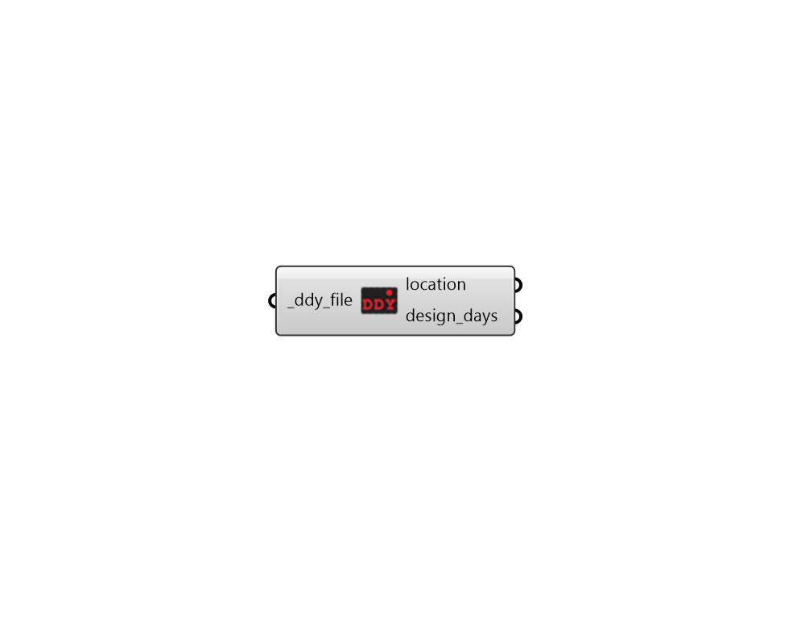

# Import DDY

 - [\[source code\]](https://github.com/ladybug-tools/ladybug-grasshopper/blob/master/ladybug_grasshopper/src//LB%20Import%20DDY.py)

Import data from a standard .ddy file.

## Inputs

* **ddy\_file \[Required\]**

  A .ddy file path on your system as a string. 

## Outputs

* **location**

  A Ladybug Location object describing the location data in the DDY file. 

* **design\_days**

  A list of DesignDay objects representing the design days contained within the ddy file. 

