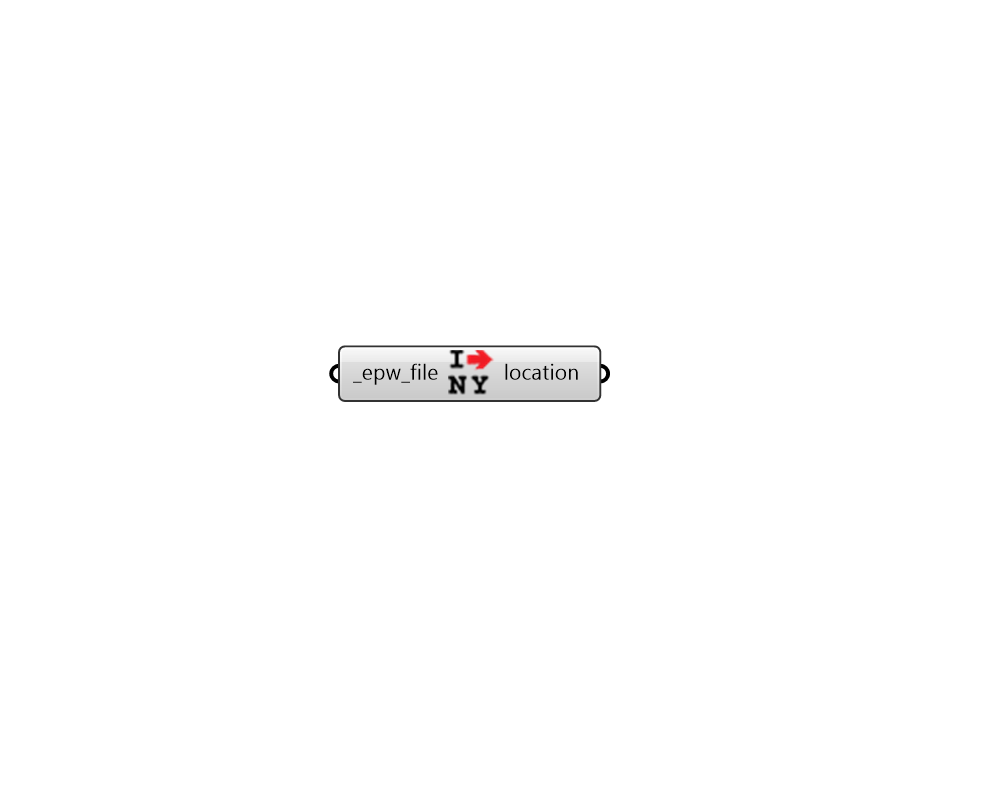

# Import Location

 - [\[source code\]](https://github.com/ladybug-tools/ladybug-grasshopper/blob/master/ladybug_grasshopper/src//LB%20Import%20Location.py)

Import location from an epw file.

## Inputs

* **epw\_file \[Required\]**

  An epw file path on your system as a string. 

## Outputs

* **location**

  Location data \(use this output to construct the sun path\). 

