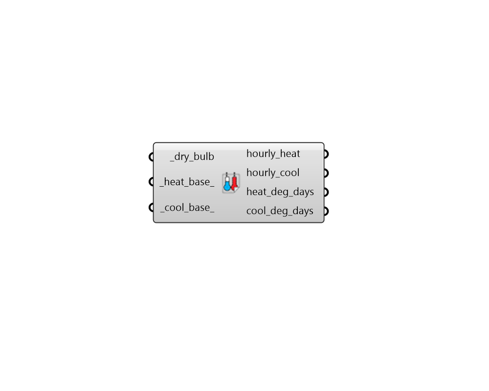

# Degree Days

 - [\[source code\]](https://github.com/ladybug-tools/ladybug-grasshopper/blob/master/ladybug_grasshopper/src//LB%20Degree%20Days.py)

Calculate humidity metrics from relative humidity, dry bulb temperature and \(if present\) atmospheric pressure.

## Inputs

* **dry\_bulb \[Required\]**

  A data collection representing outdoor dry bulb temperature \[C\] 

* **heat\_base**

  A number for the base temperature below which a given hour is considered to be in heating mode. Default is 18 Celcius, which is a common balance point for buildings. 

* **cool\_base**

  A number for the base temperature above which a given hour is considered to be in cooling mode. Default is 23 Celcius, which is a common balance point for buildings. 

## Outputs

* **hourly\_heat**

  A data collection of heating degree-days. Plug this into the 'Time Interval Operation' component to get the number of degree-days at different time intervals. 

* **hourly\_cool**

  A data collection of cooling degree-days. Plug this into the 'Time Interval Operation' component to get the number of degree-days at different time intervals. 

* **heat\_deg\_days**

  A value indicating the total number of heating degree-days over the entire input \_dry\_bulb collection. 

* **cool\_deg\_days**

  A value indicating the total number of cooling degree-days over the entire input \_dry\_bulb collection. 

