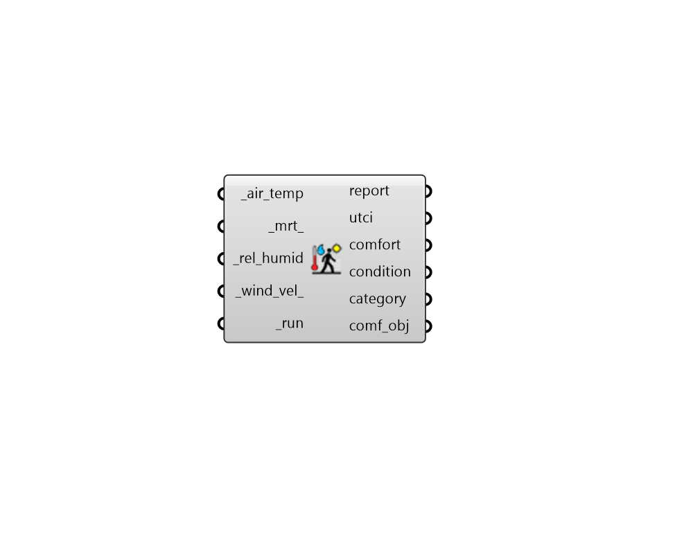

# UTCI Comfort

 - [\[source code\]](https://github.com/ladybug-tools/ladybug-grasshopper/blob/master/ladybug_grasshopper/src//LB%20UTCI%20Comfort.py)

Calculate Universal Thermal Climate Index \(UTCI\).

UTCI is a thermal comfort model strictly for the outdoors. It is an interational standard for outdoor temperature sensation \(aka. "feels-like" temperature\) and is the most common of such "feels-like" temperature metrics used by meteorologists.

While UTCI is valid in all climates, seasons, and scales, it assumes that human subjects are walking and that they naturally adapt their clothing with the outdoor temperature. For outdoor situations that do not fit these criteria, the Physiological Equivalent Temperature \(PET\) model should be used.

## Inputs

* **air\_temp \[Required\]**

  Data Collection or individual value of air temperature in C. 

* **mrt**

  Data Collection or individual value of mean radiant temperature \(MRT\) in C. Default is the same as the air\_temp. 

* **rel\_humid \[Required\]**

  Data Collection or individual value of relative humidity in %. 

* **wind\_vel**

  Data Collection or individual of air speed values in m/s. Default is a low speed of 0.5 m/s, which is the lowest input speed that is recommended for the UTCI model. 

* **run \[Required\]**

  Set to True to run the component. 

## Outputs

* **report**

  Reports, errors, warnings, etc. 

* **utci**

  Universal Thermal Climate Index \(UTCI\) in Celcius. 

* **comfort**

  Integers noting whether the input conditions result in no thermal stress. Values are one of the following:

  * 0 = thermal stress
  * 1 = no thremal stress

* **condition**

  Integers noting the thermal status of a subject. Values are one of the following:

  * -1 = cold
  * 0 = netural
  * +1 = hot

* **category**

  Integers noting the category that the UTCI conditions fall under on an 11-point scale. Values are one of the following:

  * -5 = Extreme Cold Stress \(UTCI &lt; -40\)
  * -4 = Very Strong Cold Stress \(-40 &lt;= UTCI &lt; -27\)
  * -3 = Strong Cold Stress \(-27 &lt;= UTCI &lt; -13\)
  * -2 = Moderate Cold Stress \(-12 &lt;= UTCI &lt; 0\)
  * -1 = Slight Cold Stress \(0 &lt;= UTCI &lt; 9\)
  * 0 = No Thermal Stress \(9 &lt;= UTCI &lt; 26\)
  * +1 = Slight Heat Stress \(26 &lt;= UTCI &lt; 28\)
  * +2 = Moderate Heat Stress \(28 &lt;= UTCI &lt; 32\)
  * +3 = Strong Heat Stress \(32 &lt;= UTCI &lt; 38\)
  * +4 = Very Strong Heat Stress \(38 &lt;= UTCI &lt; 46\)
  * +5 = Extreme Heat Stress \(46 &lt; UTCI\)

* **comf\_obj**

  A Python object containing all inputs and results of the analysis.  This can be plugged into components like the "Comfort Statistics" component to get further information. 

