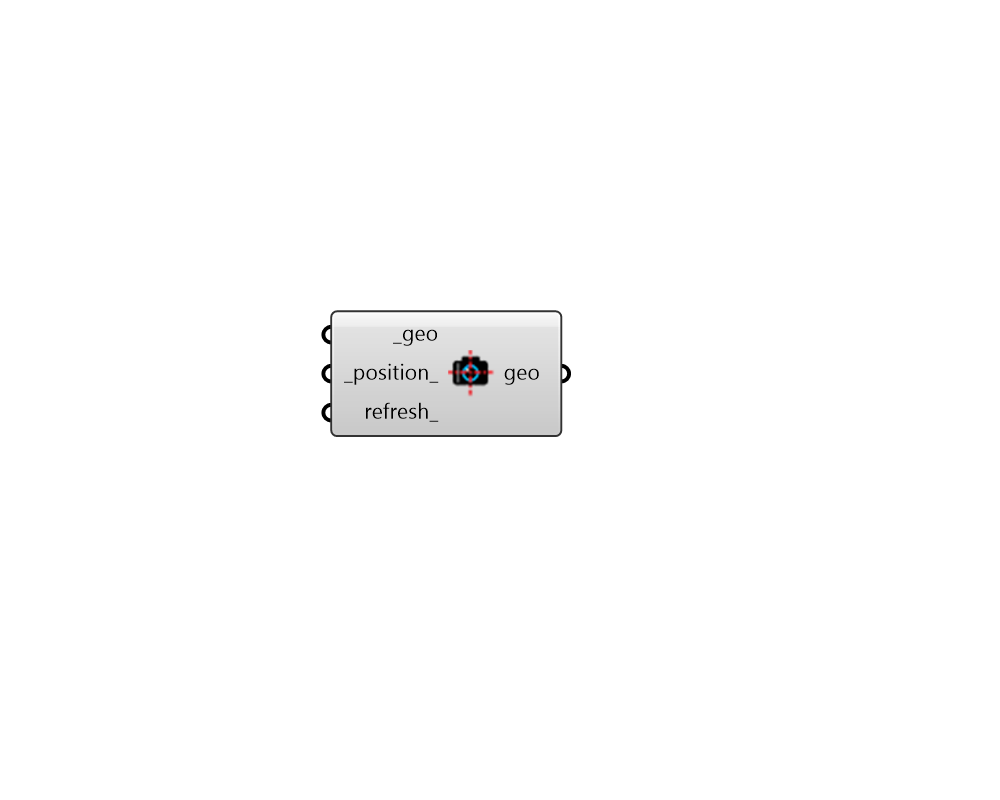

# Orient to Camera

 - [\[source code\]](https://github.com/ladybug-tools/ladybug-grasshopper/blob/master/ladybug_grasshopper/src//LB%20Orient%20to%20Camera.py)

Orient a series of geometries to the active viewport camera.

## Inputs

* **geo \[Required\]**

  A series of geometries to be oriented to the camera of the active Rhino viewport. 

* **position**

  A point to be used as the origin around which the the geometry will be oriented. If None, the lower left corner of the bounding box around the geometry will be used. 

* **refresh**

  Connect a Grasshopper "button" component to refresh the orientation upon hitting the button. You can also connect a Grasshopper "Timer" component to update the view in real time as you navigate through the Rhino scene. 

## Outputs

* **geo**

  The input geometry that has been oriented to the camera of the active Rhino viewport. 

