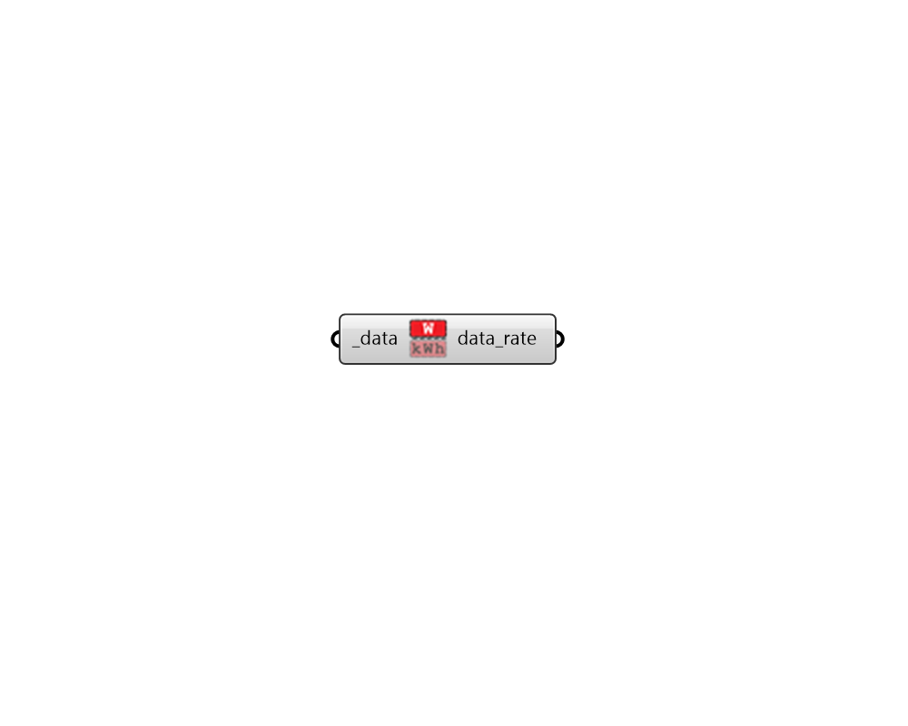

# Time Rate of Change

 - [\[source code\]](https://github.com/ladybug-tools/ladybug-grasshopper/blob/master/ladybug_grasshopper/src//LB%20Time%20Rate%20of%20Change.py)

Convert a DataCollection of time-aggregated values to time rate of change units.

For example, if the collection has an Energy data type in kWh, this method will return a collection with an Power data type in W.

## Inputs

* **data \[Required\]**

  A houry, sub-hourly or daily data collection that can converted to a time rate of change metric. \(eg. a data collection of Energy values in kWh\). 

## Outputs

* **data\_rate**

  The data collection converted to time rate of changevalues. \(eg. a data collection of Energy values in kWh\). 

