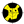

#### Component list:
*  [Direct Sun Hours](../components/Direct_Sun_Hours.md)
*  [Incident Radiation](../components/Incident_Radiation.md)
*  [View Factors](../components/View_Factors.md)
*  [View Percent](../components/View_Percent.md)
*  [View Rose](../components/View_Rose.md)
*  [Visibility Percent](../components/Visibility_Percent.md)
*  [Human to Sky Relation](../components/Human_to_Sky_Relation.md)
*  [Sky Mask](../components/Sky_Mask.md)
*  [Solar Envelope](../components/Solar_Envelope.md)
*  [Surface Ray Tracing](../components/Surface_Ray_Tracing.md)
*  [Shade Benefit](../components/Shade_Benefit.md)
*  [Thermal Shade Benefit](../components/Thermal_Shade_Benefit.md)
*  [Set Rhino Sun](../components/Set_Rhino_Sun.md)
*  [View From Sun](../components/View_From_Sun.md)
*  [Real Time Incident Radiation](../components/Real_Time_Incident_Radiation.md)