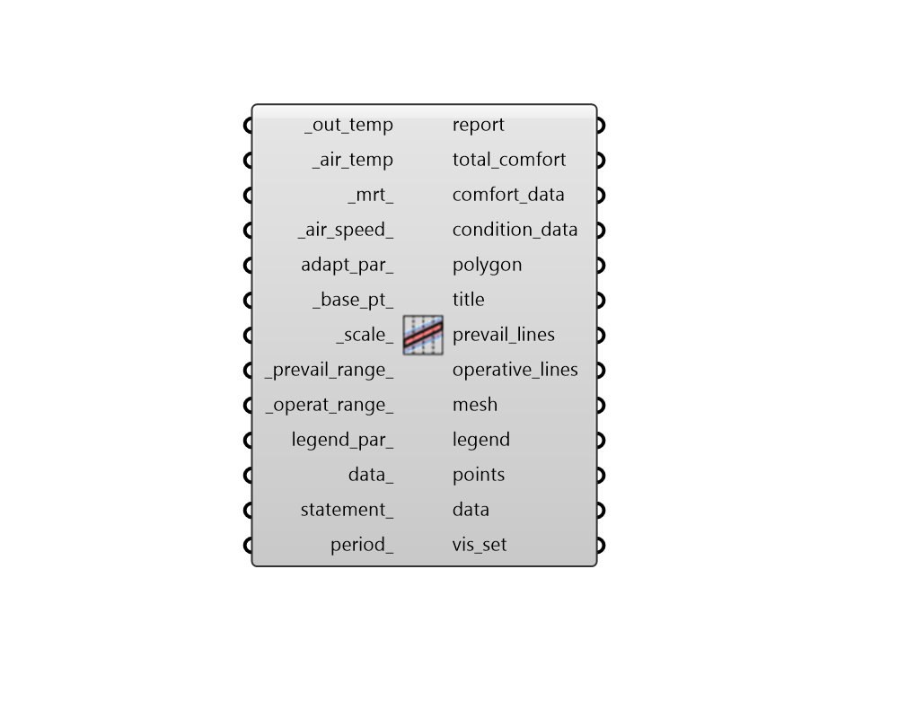

## Adaptive Chart

 - [[source code]](https://github.com/ladybug-tools/ladybug-grasshopper/blob/master/ladybug_grasshopper/src//LB%20Adaptive%20Chart.py)

Draw an adaptive comfort chart in the Rhino scene and plot a set of prevailing and indoor operative temperature values on it. 

Connected data can include outdoor temperatures from imported EPW weather data as well as indoor temperatures from an energy simulation. 

#### Inputs
* ##### out_temp [Required]
Outdoor temperatures in one of the following formats: 

    * A Data Collection of outdoor dry bulb temperatures recorded overthe entire year. This Data Collection must be continouous and must either be an Hourly Collection or Daily Collection. In the event that the input adapt_par_ has a _avgm_or_runmean_ set to True, Monthly collections are also acceptable here. Note that, because an annual input is required, this input collection does not have to align with the _air_temp or _mrt_ inputs. 

    * A Data Collection of prevailing outdoor temperature values in C.This Data Collection must align with the _air_temp or _mrt_ inputs and bear the PrevailingOutdoorTemperature data type in its header. 

    * A single prevailing outdoor temperature value in C to be usedfor all of the _air_temp or _mrt_ inputs. 
* ##### air_temp [Required]
A hourly, daily, or sub-hourly data collection of temperature values for indoor air temperature (or operative temperature). If this input data collection is in in Farenheit, the entire chart will be drawn using IP units. 
* ##### mrt 
A hourly, daily, or sub-hourly data collection for mean radiant temperature (MRT) in C. Default is the same as the air_temp, effectively interpreting the _air_temp as operative tempreature. 
* ##### air_speed 
A number for the air speed values in m/s. Note that higher air speeds in the adaptive model only widen the upper boundary of the comfort range at temperatures above 24 C and will not affect the lower temperature of the comfort range. Default is a very low speed of 0.1 m/s. 
* ##### adapt_par 
Optional comfort parameters from the "LB Adaptive Comfort Parameters" component to specify the criteria under which conditions are considered acceptable/comfortable. The default will use ASHRAE-55 adaptive comfort criteria. 
* ##### base_pt 
A point to be used as the bottom-left-most point from which all geometry of the plot will be generated. (Default: (0, 0, 0)). 
* ##### scale 
A number to set the dimensions of the chart. (Default: 1). 
* ##### prevail_range 
An optional domain (or number for the upper temperature), which will be used to set the lower and upper boundaries of prevailing outdoor temperature on the chart. These should be in Celsius if the chart is plotted in Celsius and and Fahrenheit if it is in Fahrenheit. The default is 10C to 33C when ASHRAE-55 is used and 10C to 30C when the EN standard is used. This translates to 50F to 92F for ASHRAE-55 and 50F to 86F for the EN standard. 
* ##### operat_range 
An optional domain (or number for the upper temperature), which will be used to set the lower and upper boundaries of indoor operative temperature on the chart. These should be in Celsius if the chart is plotted in Celsius and and Fahrenheit if it is in Fahrenheit. The default is 14C to 40C, which translates to 58F to 104F. 
* ##### legend_par 
An optional LegendParameter object from the "LB Legend Parameters" component to change the display of the Adaptive Chart. 
* ##### data 
Optional data collections, which are aligned with the input _air_temp, which will be output from the data of this component and can be used to color points with data. This data can also be used along with the statement_ below to select out data that meets certain conditions. 
* ##### statement 
A conditional statement as a string (e.g. a > 25). 
The variable of the first data collection should always be named 'a' (without quotations), the variable of the second list should be named 'b', and so on. 
For example, if three data collections are connected to _data and the following statement is applied: '10 < a < 30 and b < 33 and c > 2' The resulting collections will only include values where the first data collection is between 10 and 30, the second collection is less than 33 and the third collection is greater than 2. 
For this component, the input indoor air temperature will always be the last (or seconf-to-last) letter and this will be followed by the input _mrt_ (if it is present). 
* ##### period 
A Ladybug analysis period to be applied to the _out_temp and _air_temp of the input data_. 

#### Outputs
* ##### report
... 
* ##### total_comfort
The percent of the data on the adaptive chart that is inside the comfort polygon. 
* ##### comfort_data
Data collection or a 0/1 value noting whether each of the data points on the chart lies inside of the comfort polygon. 
This can be connected to the "LB Create Legend" component to generate a list of colors that can be used to color the points output from "LB Adaptive Chart" component to see exactly which points are comfortable and which are not. 
Values are one of the following: 0 = uncomfortable 1 = comfortable 
* ##### condition_data
Data collection of integers noting the thermal status of the human subject according to the assigned comfort parameters. 
This can be connected to the "LB Create Legend" component to generate a list of colors that can be used to color the points output from "LB Adaptive Chart" component to see exactly which points are hot, cold, and neutral. 
Values are one of the following: 

    * -1 = cold

    *  0 = netural

    * +1 = hot
* ##### polygon
Brep representing the range of comfort for the input parameters. 
* ##### title
Text objects for the chart title and axes titles as well as a polyline for the outer border of the chart. 
* ##### prevail_lines
A list of line segments and text objects for the outdoor prevailing temperature labels on the chart. 
* ##### operative_lines
A list of line segments and text objects for the indoor operative temperature labels on the chart. 
* ##### mesh
A colored mesh showing the number of input hours that happen in each part of the adaptive chart. 
* ##### legend
A colored legend showing the number of hours that correspond to each color. 
* ##### points
Points representing each of the input prevailing and operative temperature values. By default, this ouput is hidden and it should be connected it to a native Grasshopper preview component to view it. 
* ##### data
The input data_ with the input statements or the periods applied to it. These can be deconstructed with the "LB Deconstruct Data" component and the resulting values can be plugged into the "LB Create Legend" component to generate colors that can be used to color the points above using the native Grasshopper "Custom Preview" component. 
* ##### vis_set
An object containing VisualizationSet arguments for drawing a detailed version of the Adaptive Chart in the Rhino scene. This can be connected to the "LB Preview Visualization Set" component to display this version of the Adaptive Chart in Rhino. 