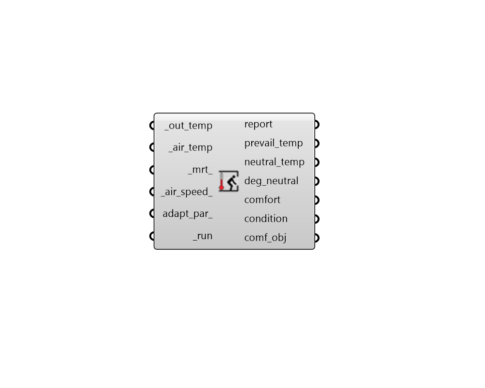

## Adaptive Comfort

 - [[source code]](https://github.com/ladybug-tools/ladybug-grasshopper/blob/master/ladybug_grasshopper/src//LB%20Adaptive%20Comfort.py)

Calculate Adaptive thermal comfort. 

The Adaptive thermal comfort model is for use on the interior of buildings where a heating or cooling system is not operational and occupants have the option to open windows for natural ventilation. 

Note that, for fully conditioned buildings, the PMV thermal comfort model should be used. 

#### Inputs
* ##### out_temp [Required]
Outdoor temperatures in one of the following formats: 

    * A Data Collection of outdoor dry bulb temperatures recorded overthe entire year. This Data Collection must be continouous and must either be an Hourly Collection or Daily Collection. In the event that the input adapt_par_ has a _avgm_or_runmean_ set to True, Monthly collections are also acceptable here. Note that, because an annual input is required, this input collection does not have to align with the _air_temp or _mrt_ inputs. 

    * A Data Collection of prevailing outdoor temperature values in C.This Data Collection must align with the _air_temp or _mrt_ inputs and bear the PrevailingOutdoorTemperature data type in its header. 

    * A single prevailing outdoor temperature value in C to be usedfor all of the _air_temp or _mrt_ inputs. 
* ##### air_temp [Required]
Data Collection or individual value for air temperature in C. 
* ##### mrt 
Data Collection or individual value for mean radiant temperature (MRT) in C. Default is the same as the air_temp. 
* ##### air_speed 
Data Collection or individual value for air speed in m/s. Note that higher air speeds in the adaptive model only widen the upper boundary of the comfort range at temperatures above 24 C and will not affect the lower temperature of the comfort range. Default is a very low speed of 0.1 m/s. 
* ##### adapt_par 
Optional comfort parameters from the "LB Adaptive Comfort Parameters" component to specify the criteria under which conditions are considered acceptable/comfortable. The default will use ASHRAE-55 adaptive comfort criteria. 
* ##### run [Required]
Set to True to run the component. 

#### Outputs
* ##### report
Reports, errors, warnings, etc. 
* ##### prevail_temp
Data Collection of prevailing outdoor temperature in degrees C. 
* ##### neutral_temp
Data Collection of the desired neutral temperature in degrees C. 
* ##### deg_neutral
Data Collection of the degrees from desired neutral temperature in degrees C. 
* ##### comfort
Integers noting whether the input conditions are acceptable according to the assigned comfort_parameter. 
Values are one of the following: 

    * 0 = uncomfortable

    * 1 = comfortable
* ##### condition
Integers noting the thermal status of a subject according to the assigned comfort_parameter. 
Values are one of the following: 

    * -1 = cold

    *  0 = netural

    * +1 = hot
* ##### comf_obj
A Python object containing all inputs and results of the analysis.  This can be plugged into components like the "Comfort Statistics" component to get further information. 