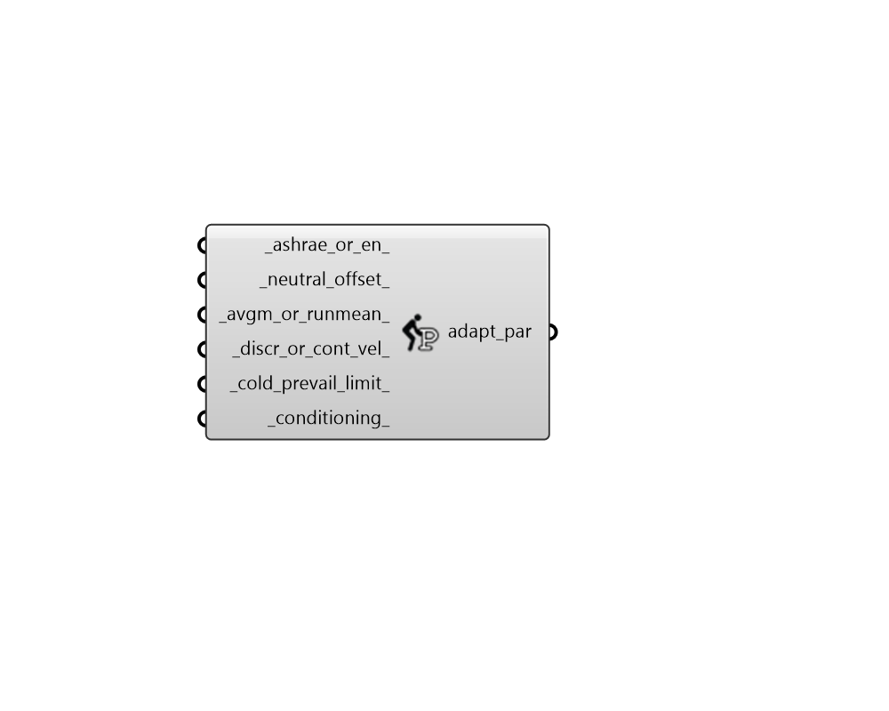

## Adaptive Comfort Parameters

 - [[source code]](https://github.com/ladybug-tools/ladybug-grasshopper/blob/master/ladybug_grasshopper/src//LB%20Adaptive%20Comfort%20Parameters.py)

Create a set of parameters that define the acceptable conditions of the Adaptive thermal comfort model. 

These parameters can be plugged into any of the components that compute Adaptive thermal comfort. 

#### Inputs
* ##### ashrae_or_en 
A boolean to note whether to use the ASHRAE-55 neutral temperature function (True) or the european neutral function (False), which is consistent with EN-16798 (and the older EN-15251). Preference is given to EN-16798 in places where EN-16798 and EN-15251 differ (eg. the 1C lower cold threshold in EN-16798). Note that this input will also determine default values for many of the other properties of this object. 
* ##### neutral_offset 
The number of degrees Celcius from the neutral temperature where the input operative temperature is considered acceptable. The default is 2.5C when the neutral temperature function is ASHRAE-55 (consistent with 90% PPD) and 3C when the neutral temperature function is EN-16798 (consistent with comfort class II). Note that, when the neutral temperature function is EN-16798, one degree Celsius is automatically added to the offset value input here to get the lower temperature threshold. This accounts for the fact that EN-16798 does not interpret the neutral offset symmetically. 
For ASHRAE-55, the following neutral offsets apply. 

    * 90 PPD - 2.5C

    * 80 PPD - 3.5C
For the EN standard, the following neutral offsets apply. 

    * Class I - 2C

    * Class II - 3C

    * Class III - 4C
* ##### avgm_or_runmean 
A boolean to note whether the prevailing outdoor temperature is computed from the average monthly temperature (True) or a weighted running mean of the last week (False).  The default is True when the neutral temperature function is ASHRAE-55 and False when the neutral temperature function is EN. 
* ##### discr_or_cont_vel 
A boolean to note whether discrete categories should be used to assess the effect of elevated air speed (True) or whether a continuous function should be used (False). Note that continuous air speeds were only used in the older EN-15251 standard and are not a part of the more recent EN-16798 standard. When unassigned, this will be True for discrete air speeds. 
* ##### cold_prevail_limit 
A number indicating the prevailing outdoor temperature below which acceptable indoor operative temperatures flat line. The default is 10C, which is consistent with both ASHRAE-55 and EN-16798. However, 15C was used for the older EN-15251 standard. This number cannot be greater than 22C and cannot be less than 10C. 
* ##### conditioning 
A number between 0 and 1 that represents how "conditioned" vs. "free-running" the building is. 0 = free-running (completely passive with no air conditioning) 1 = conditioned (no operable windows and fully air conditioned) The default is 0 since both the ASHRAE-55 and the EN standards prohibit the use of adaptive comfort methods when a heating/cooling system is active. When set to a non-zero number, a neutral temperature function for heated/cooled operation derived from the SCATs database will be used. For more information on how adaptive comfort methods can be applied to conditioned buildings, see the neutral_temperature_conditioned function in the ladybug_comfort documentation. 

#### Outputs
* ##### adapt_par
An Adaptive comfort parameter object that can be plugged into any of the components that compute Adaptive thermal comfort. 