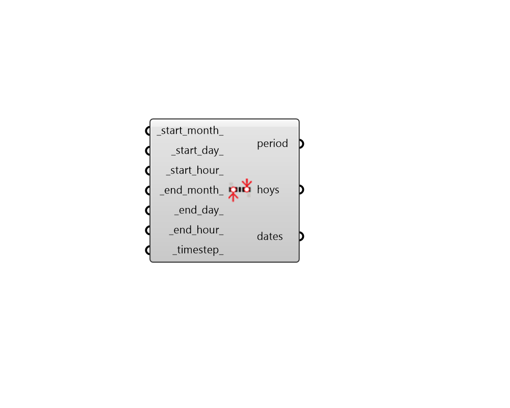

##  Analysis Period

Analysis Period.
 -

#### Inputs
* ##### startMonth [Default]
Start month (1-12).
* ##### startDay [Default]
Start day (1-31).
* ##### startHour [Default]
Start hour (0-23).
* ##### endMonth [Default]
End month (1-12).
* ##### endDay [Default]
End day (1-31).
* ##### endHour [Default]
End hour (0-23).
* ##### timestep [Default]
An integer number from 1, 2, 3, 4, 5, 6, 10, 12, 15, 20, 30, 60

#### Outputs
* ##### analysisPeriod
Analysis period.
* ##### hoys
List of dates in this analysis period.
* ##### dates
List of hours of the year in this analysis period.

[Check Hydra Example Files for Analysis Period](https://hydrashare.github.io/hydra/index.html?keywords=LadybugPlus_Analysis Period)