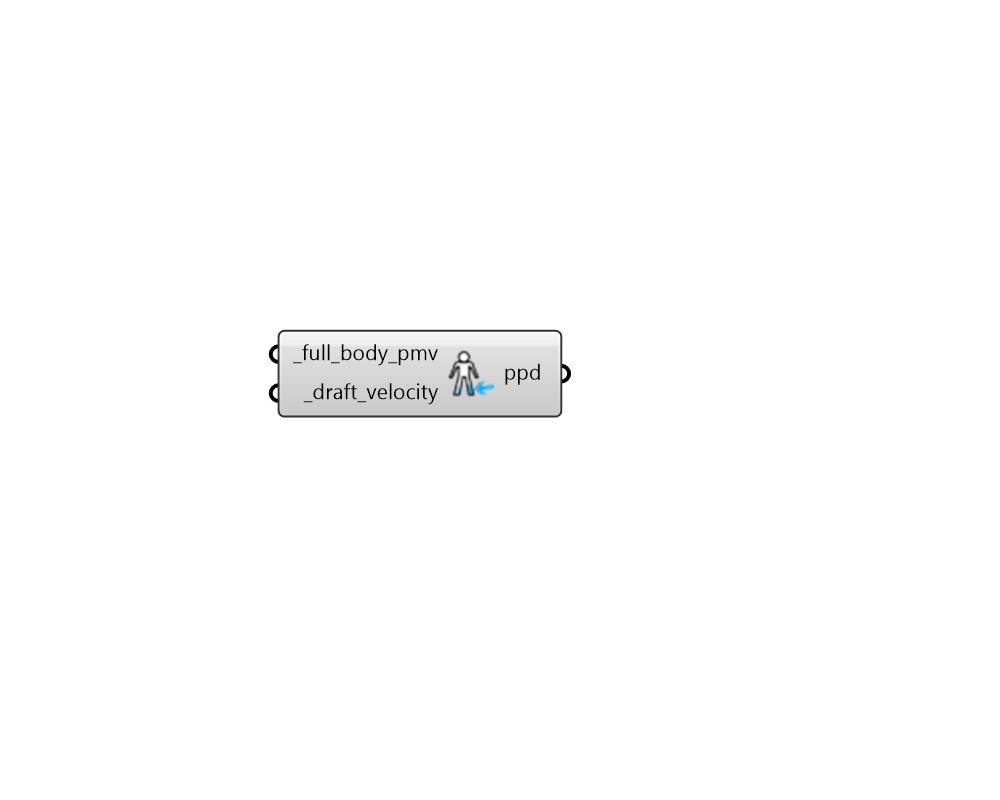

## Ankle Draft

 - [[source code]](https://github.com/ladybug-tools/ladybug-grasshopper/blob/master/ladybug_grasshopper/src//LB%20Ankle%20Draft.py)

Calculate the percentage of people dissatisfied from cold drafts at ankle-level. 

The original tests used to create the model involved blowing cold air on subject's ankles at a height of 10 cm off of the ground. The formula was officially incorporated in the ASHRAE 55 standard in 2020 with a recommendation that PPD from ankle draft not exceed 20%. 

For more information on the methods used to create this model see the following: Liu, S., S. Schiavon, A. Kabanshi, W. Nazaroff. 2016. "Predicted percentage of dissatisfied with ankle draft." Accepted Author Manuscript. Indoor Environmental Quality. http://escholarship.org/uc/item/9076254n 

#### Inputs
* ##### full_body_pmv [Required]
The full-body predicted mean vote (PMV) of the subject. Ankle draft depends on full-body PMV because subjects are more likely to feel uncomfortably cold at their extremities when their whole body is already feeling colder than neutral. The "LB PMV Comfort" component can be used to obatin this input here. 
* ##### draft_velocity [Required]
The velocity of the draft in m/s at ankle level (10cm above the floor). 

#### Outputs
* ##### ppd
The percentage of people dissatisfied (PPD) from cold drafts at ankle level. 