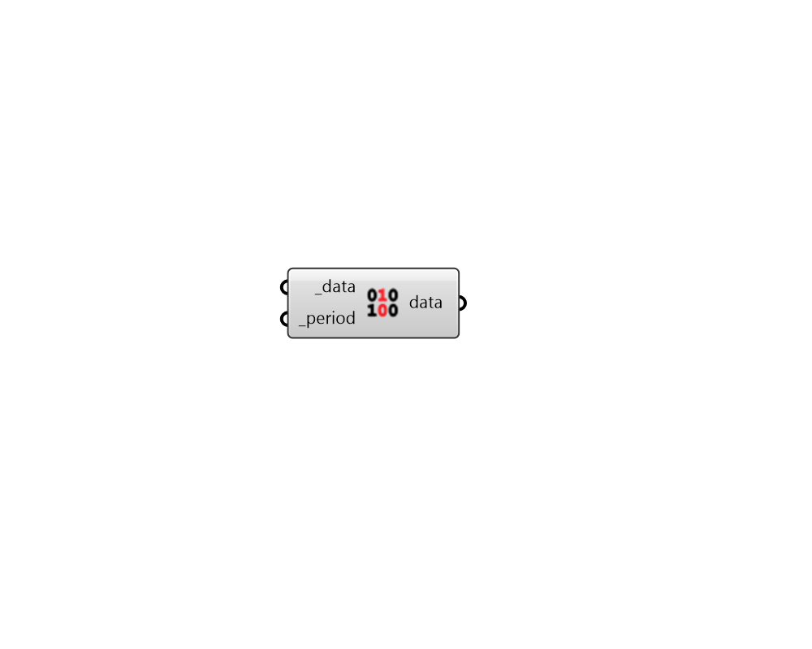

## Apply Analysis Period

 - [[source code]](https://github.com/ladybug-tools/ladybug-grasshopper/blob/master/ladybug_grasshopper/src//LB%20Apply%20Analysis%20Period.py)

Apply an analysis period to a data collection. 

#### Inputs
* ##### data [Required]
A Ladybug data collection object. 
* ##### period [Required]
A Ladybug analysis period from the "LB AnalysisPeriod" component. 

#### Outputs
* ##### data
The data collection with the analysis period applied to it. 