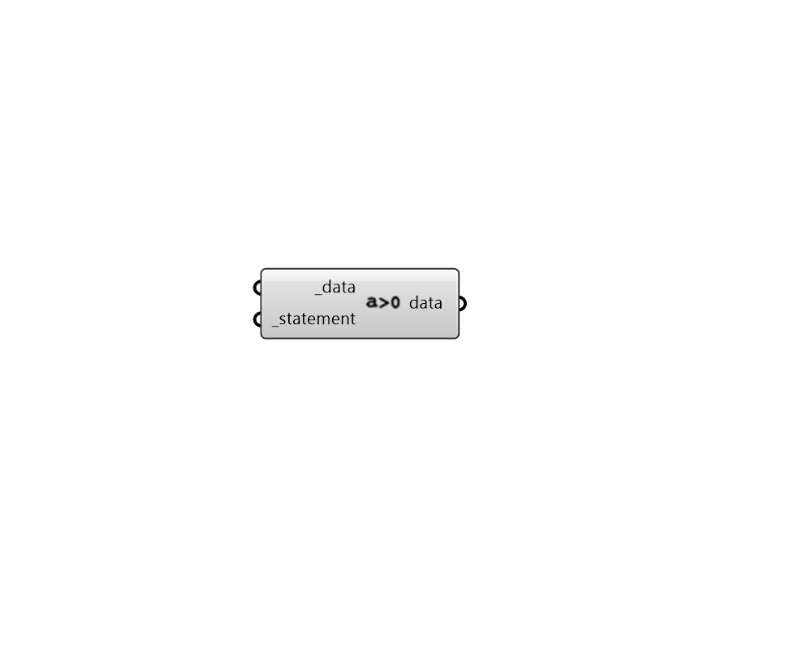

## Apply Conditional Statement

 - [[source code]](https://github.com/ladybug-tools/ladybug-grasshopper/blob/master/ladybug_grasshopper/src//LB%20Apply%20Conditional%20Statement.py)

Apply a conditional statement to a data collection. 

#### Inputs
* ##### data [Required]
A list of aligned Data Collections to be evaluated against the _statement. 
* ##### statement [Required]
A conditional statement as a string (e.g. a > 25). 
The variable of the first data collection should always be named 'a' (without quotations), the variable of the second list should be named 'b', and so on. 
For example, if three data collections are connected to _data and the following statement is applied: '18 < a < 26 and b < 80 and c > 2' The resulting collections will only include values where the first data collection is between 18 and 26, the second collection is less than 80 and the third collection is greater than 2. 

#### Outputs
* ##### data
A list of Data Collections that have been filtered by the _statement. 