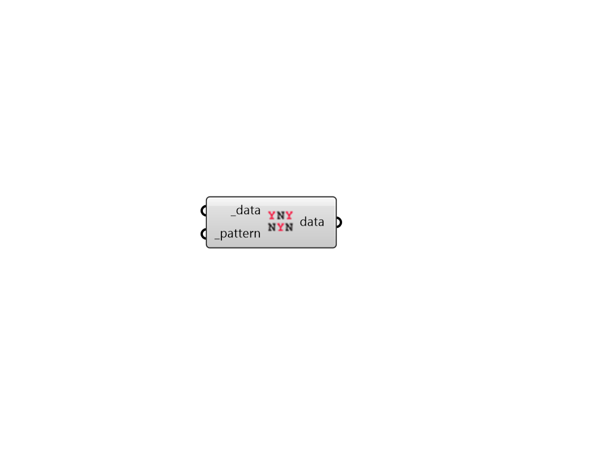

## Apply Pattern

 - [[source code]](https://github.com/ladybug-tools/ladybug-grasshopper/blob/master/ladybug_grasshopper/src//LB%20Apply%20Pattern.py)

Filter a data collection or list of data collections by a pattern of True/False values. True values will be kept while False values will be filtered out. 

#### Inputs
* ##### data [Required]
A Data Collection or list of aligned Data Collections to be filtered by a pattern. 
* ##### pattern [Required]
A list of True/False values. Typically, list has a length matching the length of the Data Collection(s)'s values. However, it can also be a pattern to be repeated over the Data Collection(s)'s values. 

#### Outputs
* ##### data
A list of Data Collections that have been filtered by the _pattern. 