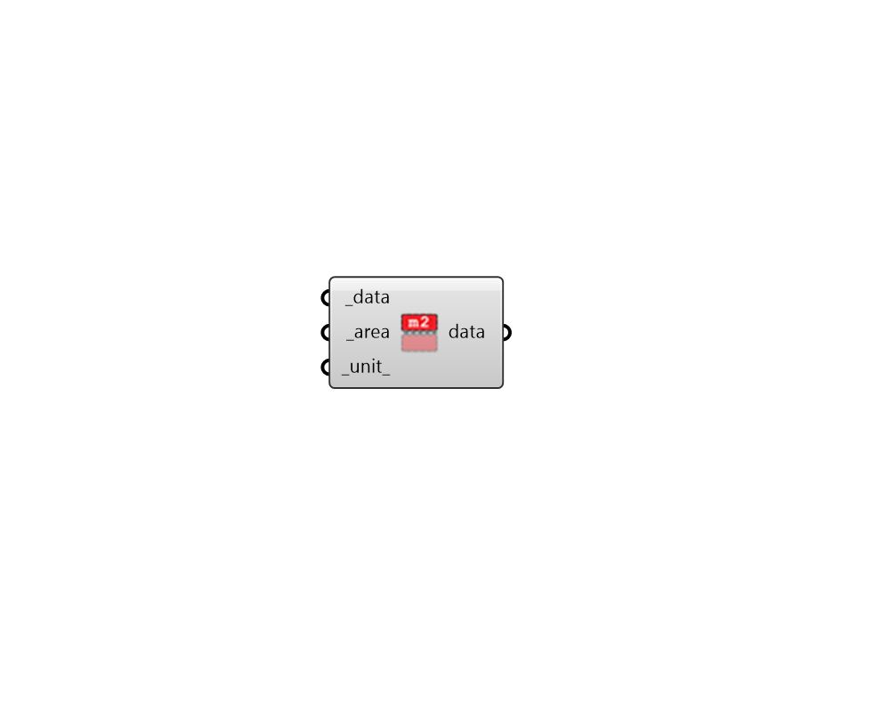
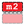

## Area Aggregate

 - [[source code]](https://github.com/ladybug-tools/ladybug-grasshopper/blob/master/ladybug_grasshopper/src//LB%20Area%20Aggregate.py)

Get a Data Collection that is aggregated by an area value. 

Note that this component will raise a ValueError if the data type in the header of the data collection is not normalizable to yeild a useful type. 

#### Inputs
* ##### data [Required]
A Data Collection to be aggregated by the input _area. 
* ##### area [Required]
A number representing area by which all of the data is aggregated. 
* ##### unit 
Text for the units that the area value is in. Acceptable inputs include 'm2', 'ft2' and any other unit that is supported. (Default: m2). 

#### Outputs
* ##### data
A Ladybug data collection object aggregated by the input area 