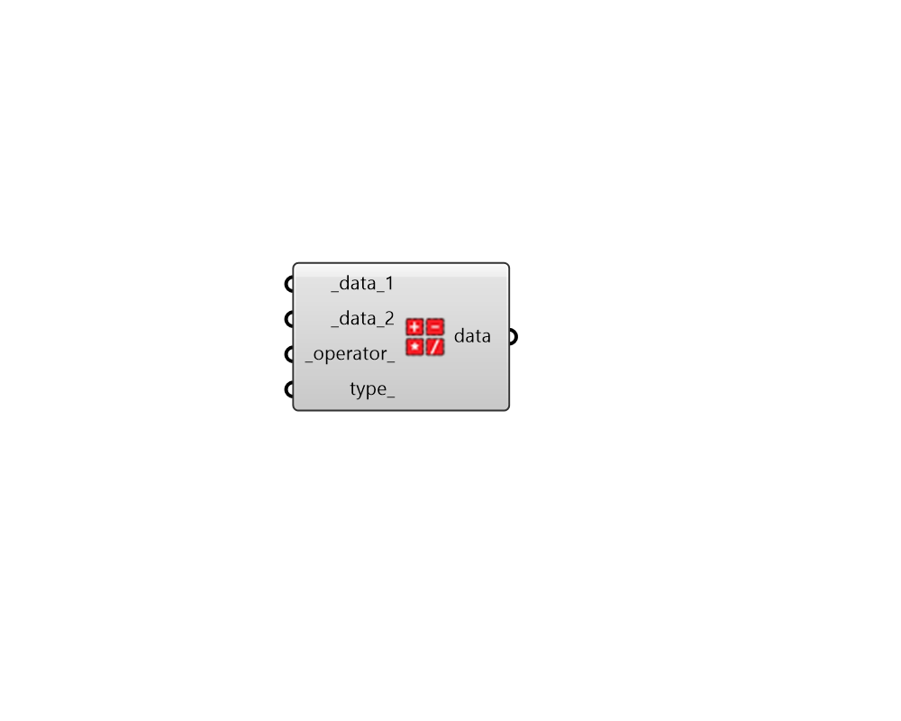

## Arithmetic Operation

 - [[source code]](https://github.com/ladybug-tools/ladybug-grasshopper/blob/master/ladybug_grasshopper/src//LB%20Arithmetic%20Operation.py)

Perform simple arithmetic operations between Data Collections. For example, adding two Data Collections together, subtracting one collection from another, or multiplying/dividing a data in a collection by a factor. 

Note that Data Collections must be aligned in order for this component to run successfully. 

Using this component will often be much faster and more elegant compared to deconstructing the data collection, performing the operation with native Grasshopper components, and rebuilding the collection. 

#### Inputs
* ##### data_1 [Required]
The first Data Collection in the operation. If the operator is not commutative, this collection comes before the operator. For example, in subtraction, this is the collection being subtracted from. This can also be a list of Data Collections that align with _data_2. It cal also be a single number that will be added, multiplied, etc. to all of _data_2. 
* ##### data_2 [Required]
The second Data Collection in the operation. If the operator is not commutative, this collection comes after the operator. For example, in subtraction, this is the collection being subtracted with. This can also be a list of Data Collections that align with _data_1. It cal also be a single number that will be added, multiplied, etc. to all of _data_1. 
* ##### operator 
Text for the operator to use between the two Data Collections. Valid examples include (+, -, *, /). By default this is + for addition. 
* ##### type 
Optional text for a new "type" key in the Data Collection's metadata. This will usually show up in most Ladybug visualiztions and it should usually change for most types of operations. 

#### Outputs
* ##### data
A Ladybug data collection object derived from the operation between the two data inputs. 