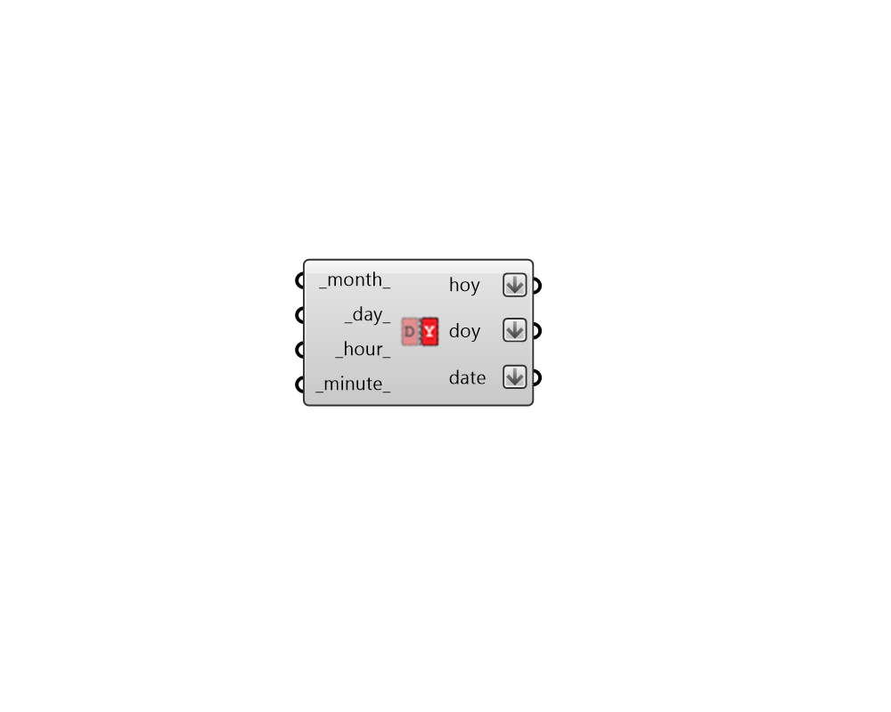

##  Calculate HOY - [[source code]](https://github.com/ladybug-tools/ladybug-grasshopper/tree/master/plugin/grasshopper/src/LadybugPlus_Calculate%20HOY.py)

Calculate hour of the year.
 -

#### Inputs
* ##### month [Default]
Month (1-12).
* ##### day [Default]
Day (1-31).
* ##### hour [Default]
Hour (0-23).
* ##### minute [Default]
Minute (0-59).

#### Outputs
* ##### hoy
Hour of the year.
* ##### doy
Day of the year.
* ##### date
Human readable date.

[Check Hydra Example Files for Calculate HOY](https://hydrashare.github.io/hydra/index.html?keywords=LadybugPlus_Calculate HOY)