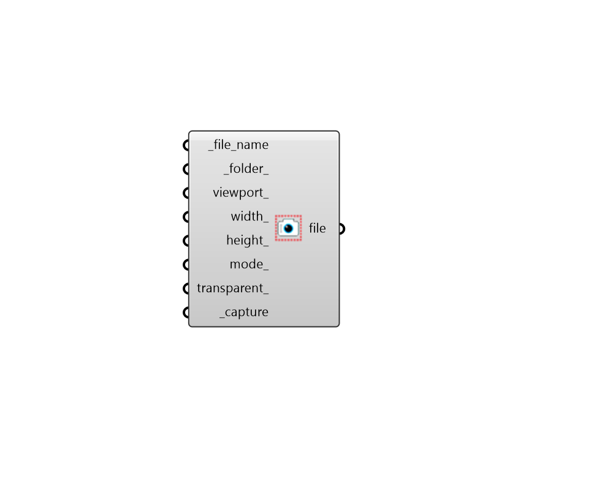

##  Capture View - [[source code]](https://github.com/ladybug-tools/ladybug-grasshopper/blob/master/ladybug_grasshopper/src//LB%20Capture%20View.py)

Capture views of the Rhino scene and save them to your hard drive as as a .png files.
 

This is particularly useful when creating animations and one needs to automate
 the capturing of views. Note that images will likely have a Rhino world axes icon
 in the lower left of the image unless you go to Options > Grid > and uncheck
 "Show world axes icon".
 

#### Inputs
* ##### file_name [Required]
The file name, which the image will be saved as. Note that, for animations, each saved image should have a different name. Otherwise, the previous image will be overwritten by each successive image. Unique names for each animation frame can be achieved by using the animating slider to generate the file name. 
* ##### folder 
The folder into which the image file will be written. This should be a complete path to the folder. If None, the images will be written to one of the following default locations: 
Windows - C:/Users/[USERNAME]/ladybug_tools/resources/captured_views/ Mac - /Users/[USERNAME]/ladybug_tools/resources/captured_views/ 
* ##### viewport 
Text for the Rhino viewport name which will be captured. This can also be a list of viewports in which case multiple views will be captured. If None, the default will be the active viewport (the last viewport in which you navigated). Acceptable inputs include: 
Perspective Top Bottom Left Right Front Back any view name that has been saved within the Rhino file 
* ##### width 
Integer for the width of the image to be captured in pixels. If None, the default is the width of the Rhino viewport currently on the screen. 
* ##### height 
Integer for the height of the image to be captured in pixels. If None, the default is the height of the Rhino viewport currently on the screen. 
* ##### mode 
Text for the display mode of the viewport to be captured.If None, the default will be the display mode of the active viewport (the last viewport in which you navigated). Acceptable inputs include: 
Wireframe Shaded Rendered Ghosted X-Ray Technical Artistic Pen 
* ##### transparent 
Boolean to note whether the captured .png file should have a transparent background. If None or False, the image will have the Rhino viewport background color. 
* ##### capture [Required]
Set to "True" to capture the image of the Rhino viewport. 

#### Outputs
* ##### file
The file path of the image taken with this component.