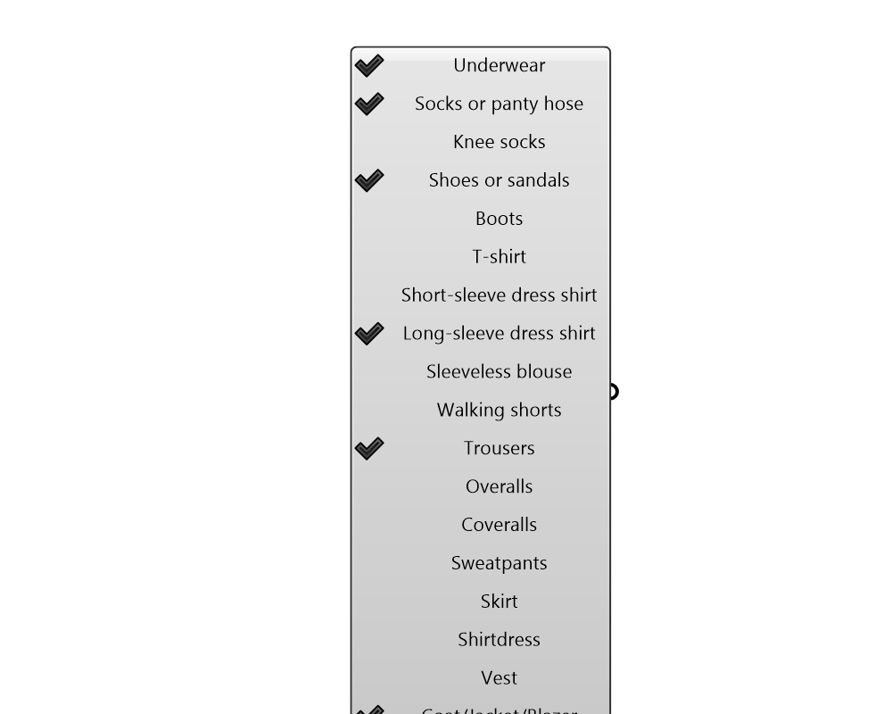

## Clothing List

 - [[source code]](https://github.com/ladybug-tools/ladybug-grasshopper/blob/master/ladybug_grasshopper/src//LB%20Clothing%20List.py)

Provides a list of clothing values based on selected apparel.  Plug the output into a native Grasshopper Mass Addition component to get the total clothing level of the clothing ensemble. 