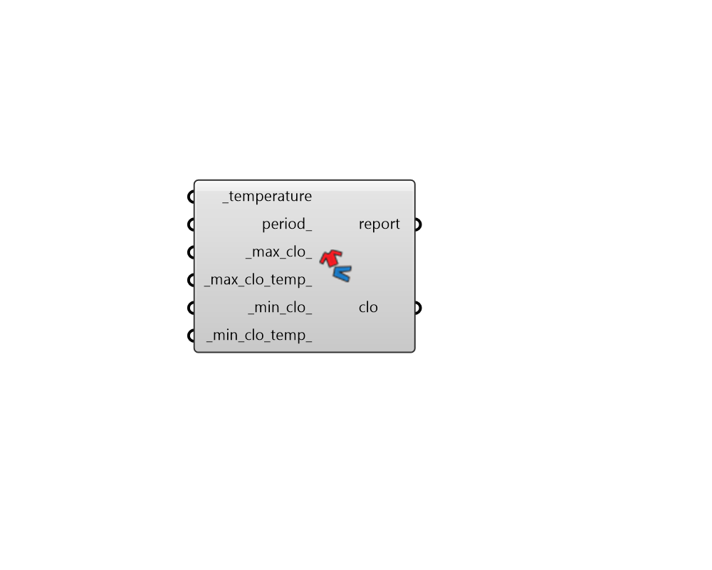

## Clothing by Temperature

 - [[source code]](https://github.com/ladybug-tools/ladybug-grasshopper/blob/master/ladybug_grasshopper/src//LB%20Clothing%20by%20Temperature.py)

Estimate levels of clothing using a temperature value or data collection of temperatures to which a human subject is adapting (typically the outdoor air temperature). 

This resulting clothing values can be plugged into the _clothing_ input of the "LB PMV Comfort" component or the "HB PMV Comfort Map". 

By default, this function derives clothing levels using a model developed by Schiavon, Stefano based on outdoor air temperature, which is implemented in the CBE comfort tool (https://comfort.cbe.berkeley.edu/). 

The version of the model implemented here allows changing of the maximum and minimum clothing levels, which the Schiavon model sets at 1 and 0.46 respectively, and the temperatures at which these clothing levels occur, which the Schiavon model sets at -5 C and 26 C respectively. 

#### Inputs
* ##### temperature [Required]
A data collection or single number representing the temperature to which the human subject adapts their clothing. This is typically the dry bulb temperature obtained from the "LB Import EPW" component. 
* ##### period 
If you have hooked up annual temperatures from the importEPW component, use this input to  
* ##### max_clo 
A number for the maximum clo value that the human subject wears on the coldest days. (Default: 1 clo, per the original Schiavon clothing function). 
* ##### max_clo_temp 
A number for the temperature below which the _max_clo_ value is applied (in Celsius). (Default: -5 C, per the original Schiavon clothing function with outdoor temperature). 
* ##### min_clo 
A number for the minimum clo value that the human subject wears wears on the hotest days. (Default: 0.46 clo, per the original Schiavon clothing function). 
* ##### min_clo_temp 
A number for the temperature above which the _min_clo_ value is applied (in Celsius). (Default: 26 C, per the original Schiavon clothing function). 

#### Outputs
* ##### report
Reports, errors, warnings, etc. 
* ##### clo
A single number or data collection of numbers representing the clothing that would be worn (in clo). Note that, if you have hooked up an hourly continuous data collection, the clothing levels will change on a 12-hour basis to simulate the typical cycle on which a human changes their clothing. 