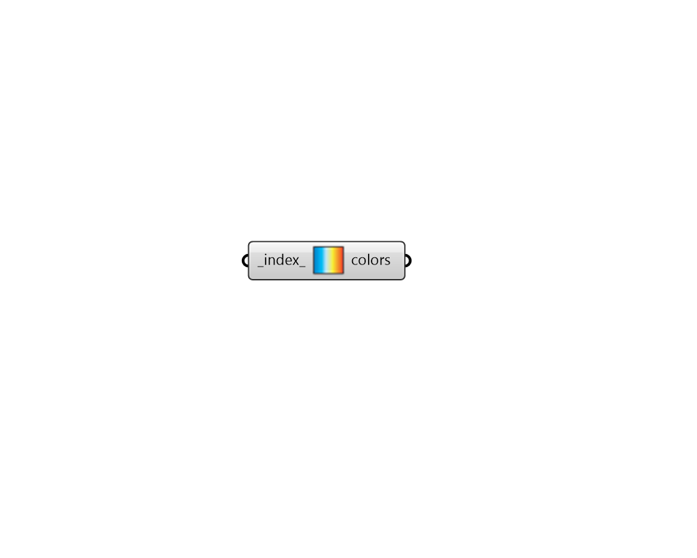

## Color Range
 - [[source code]](https://github.com/ladybug-tools/ladybug-grasshopper/blob/master/ladybug_grasshopper/src//LB%20Color%20Range.py)

Use this component to access a library of typical gradients useful throughout Ladybug. 
 The output from this component should be plugged into the colors_ input of the
 "Legend Parameters" component.
 

For an image of each of the gardients in the library, check here:
 https://github.com/mostaphaRoudsari/ladybug/blob/master/resources/gradients.jpg
 

#### Inputs
* ##### index 
An index refering to one of the following possible gradients: 0 - Orignal Ladybug 1 - Nuanced Ladybug 2 - Multi-colored Ladybug 3 - Ecotect 4 - View Study 5 - Shadow Study 6 - Glare Study 7 - Annual Comfort 8 - Thermal Comfort 9 - Peak Load Balance 10 - Heat Sensation 11 - Cold Sensation 12 - Benefit/Harm 13 - Harm 14 - Benefit 15 - Shade Benefit/Harm 16 - Shade Harm 17 - Shade Benefit 18 - Energy Balance 19 - Energy Balance w/ Storage 20 - THERM 21 - Cloud Cover 22 - Black to White 23 - Blue, Green, Red 24 - Multicolored 2 25 - Multicolored 3 

#### Outputs
* ##### colors
A series of colors to be plugged into the "LB Legend Parameters" component. 