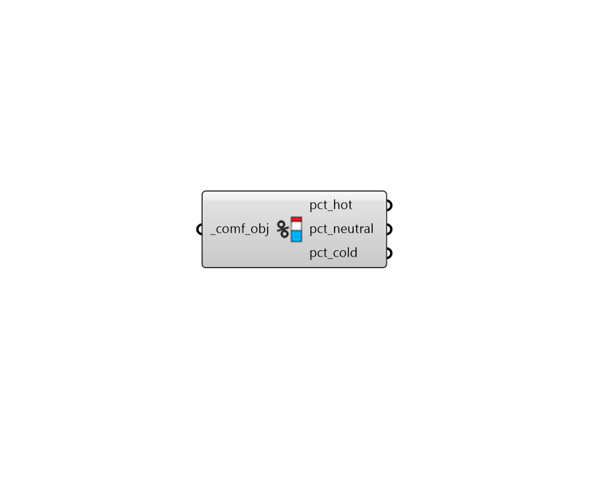

## Comfort Statistics

 - [[source code]](https://github.com/ladybug-tools/ladybug-grasshopper/blob/master/ladybug_grasshopper/src//LB%20Comfort%20Statistics.py)

Get statitics of thermal comfort from a Ladybug Comfort Object. 

#### Inputs
* ##### comf_obj [Required]
A Ladybug ComfortCollection object from any of the comfort model components. 

#### Outputs
* ##### pct_hot
The percent of time that conditions are hotter than acceptable limits. 
* ##### pct_neutral
The percent of time that conditions are within acceptable limits (aka. the percent of time comfortable). 
* ##### pct_cold
The percent of time that conditions are colder than acceptable limits. 