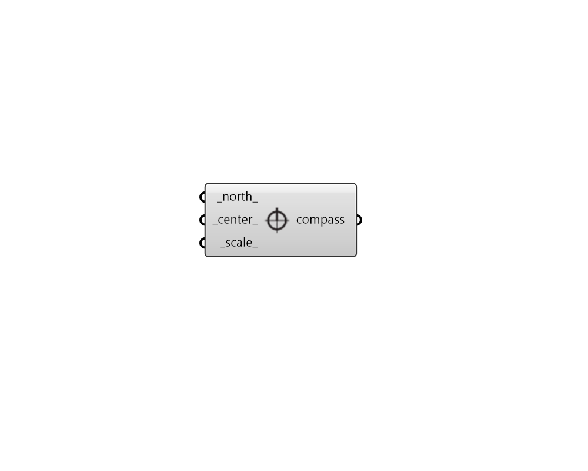

## Compass

 - [[source code]](https://github.com/ladybug-tools/ladybug-grasshopper/blob/master/ladybug_grasshopper/src//LB%20Compass.py)

Create a compass sign that indicates the direction of North in the Rhino scene. 

#### Inputs
* ##### north 
A number between -360 and 360 for the counterclockwise difference between the North and the positive Y-axis in degrees. Counterclockwise means "90 is West and 270 is East". This can also be Vector for the direction to North. (Default: 0) 
* ##### center 
A point for the center position of the compass in the Rhino scene. (Default: (0, 0, 0) aka. the Rhino scene origin). 
* ##### scale 
A number to set the scale of the compass. The default is 1, which corresponds to a radius of 10 meters in the current Rhino model's unit system. 

#### Outputs
* ##### compass
A set of circles, lines and text objects that mark the cardinal directions in the Rhino scene. 