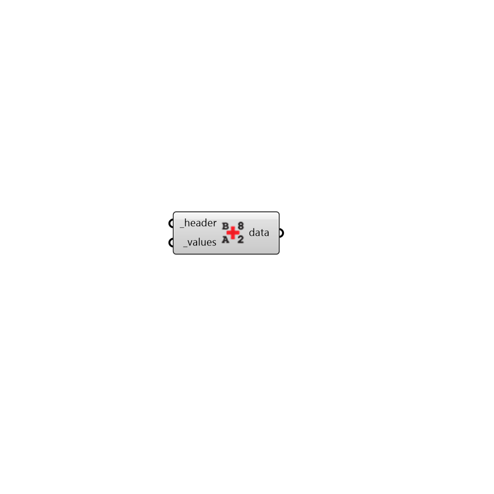

## Construct Data

 - [[source code]](https://github.com/ladybug-tools/ladybug-grasshopper/blob/master/ladybug_grasshopper/src//LB%20Construct%20Data.py)

Construct a Ladybug data collection from header and values. 

#### Inputs
* ##### header [Required]
A Ladybug header object describing the metadata of the data collection. 
* ##### values [Required]
A list of numerical values for the data collection. 
* ##### interval 
Text to indicate the time interval of the data collection, which determines the type of collection that is output. (Default: hourly). 
Choose from the following: 

    - hourly

    - daily

    - monthly

    - monthly-per-hour
Note that the "hourly" input is also used to represent sub-hourly intervals (in this case, the timestep of the analysis period must not be 1). 

#### Outputs
* ##### data
A Ladybug data collection object. 