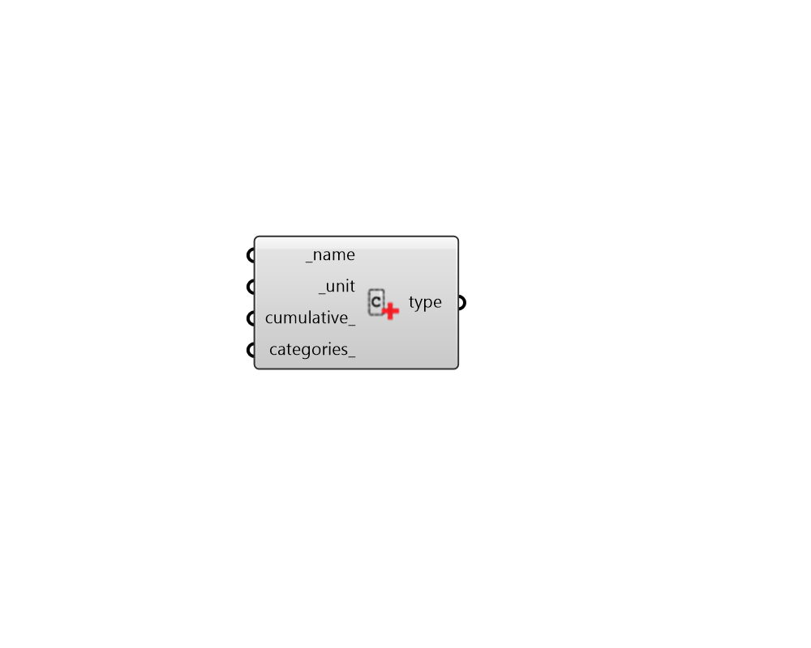

##  Construct Data Type - [[source code]](https://github.com/ladybug-tools/ladybug-grasshopper/blob/master/ladybug_grasshopper/src//LB%20Construct%20Data%20Type.py)

Construct a Ladybug DataType to be used in the header of a ladybug DataCollection.
 

#### Inputs
* ##### name [Required]
A name for the data type as a string. 
* ##### unit [Required]
A unit for the data type as a string. 
* ##### categories 
An optional list of text for categories to be associated with the data type. These categories will show up in the legend whenever data with this data type is visualized. The input should be text strings with a category number (integer) and name separated by a colon. For example: 
.    -1: Cold .     0: Neutral .     1: Hot 

#### Outputs
* ##### type
A Ladybug DataType object that can be assigned to the header of a Ladybug DataCollection.