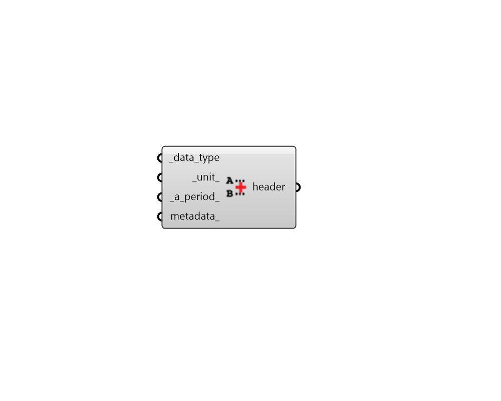

##  Construct Header - [[source code]](https://github.com/ladybug-tools/ladybug-grasshopper/blob/master/ladybug_grasshopper/src//LB%20Construct%20Header.py)

Construct a Ladybug Header to be used to create a ladybug DataCollection.
 

#### Inputs
* ##### data_type [Required]
Text representing the type of data (e.g. Temperature). A full list
 of acceptable inputs can be seen by checking the all_u output of
 the "LB Unit Converter" component. This input can also be a custom
 DataType object that has been created with the "LB Construct Data
 Type" component. 
* ##### unit 
Units of the data_type (e.g. C). Default is to use the
 base unit of the connected_data_type. 
* ##### a_period 
Script variable constrData 
* ##### metadata 
Optional metadata to be associated with the Header. The input should
 be a list of text strings with a property name and value for the
 property separated by a colon. For example:
 
.    source: TMY
 .    city: New York
 .    country: USA 

#### Outputs
* ##### header
A Ladybug Header object.