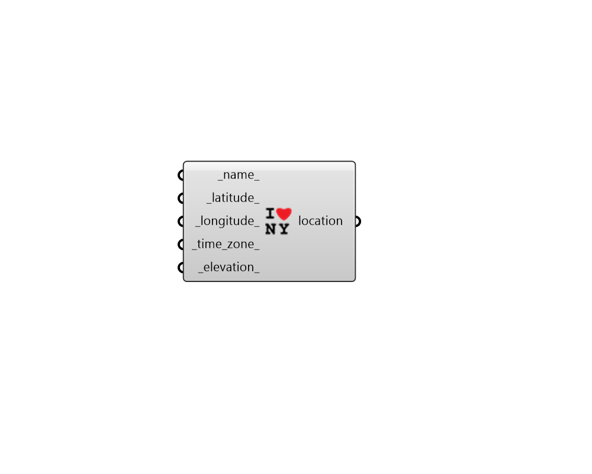

## Construct Location
 - [[source code]](https://github.com/ladybug-tools/ladybug-grasshopper/blob/master/ladybug_grasshopper/src//LB%20Construct%20Location.py)

Construct location from latitude, lognitude, and time zone data.
 

#### Inputs
* ##### name 
A name for the location you are constructing. For example, "Steventon Island, Antarctica". (Default: "-") 
* ##### latitude 
Location latitude between -90 and 90 (Default: 0). 
* ##### longitude 
Location longitude between -180 (west) and 180 (east) (Default: 0). 
* ##### time_zone 
Time zone between -12 hours (west) and 12 hours (east). If None, the time zone will be an estimated integer value derived from the longitude in accordance with solar time (Default: None). 
* ##### elevation 
A number for elevation of the location in meters. (Default: 0). 

#### Outputs
* ##### location
Location data (use this output to construct the sun path). 