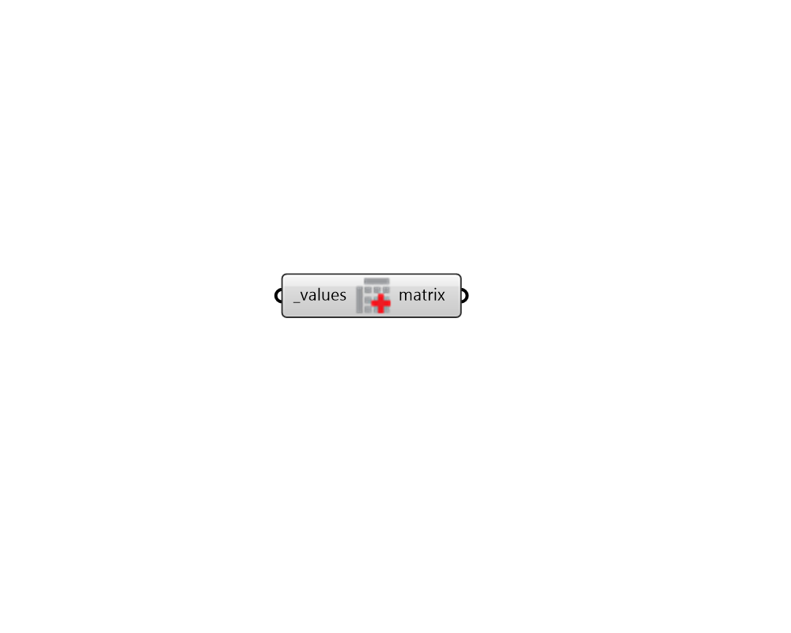

##  Construct Matrix - [[source code]](https://github.com/ladybug-tools/ladybug-grasshopper/blob/master/ladybug_grasshopper/src//LB%20Construct%20Matrix.py)

Construct a Ladybug Matrix object from a Grasshopper Data Tree of values.
 

#### Inputs
* ##### values [Required]
A Grasshopper Data Tree of values to be merged into a matrix object. 

#### Outputs
* ##### matrix
A Ladybug Matrix object encapsulating all of the input values.