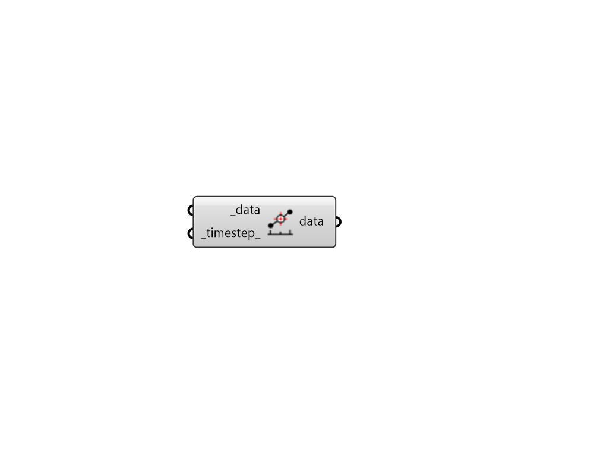

##  Convert to Timestep - [[source code]](https://github.com/ladybug-tools/ladybug-grasshopper/blob/master/ladybug_grasshopper/src//LB%20Convert%20to%20Timestep.py)

Convert a hourly Ladybug data collection to a continuous collection at a
 specific timestep.
 

This will be done either through linear interpolation or by culling out values
 that do not fit the timestep.  It can also be used to convert a discontinous
 data collection to a continuous one by linearly interpolating over holes in
 the data set.
 

#### Inputs
* ##### data [Required]
A Ladybug Hourly DataCollection object.  This can be either
 continuous or discontinuous. 
* ##### timestep 
The timestep to which the data will be converted. If this
 is higher than the input _data timestep, values will be
 linerarly interpolated to the new timestep.  If it is lower,
 values that do not fit the timestep will be removed from the
 DataCollection. (Defaut: 1) 

#### Outputs
* ##### data
A Continuous DataCollection at the input _timestep_.