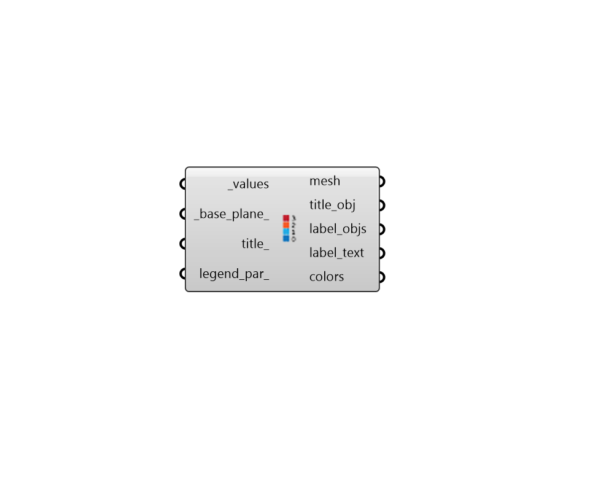

## Create Legend

 - [[source code]](https://github.com/ladybug-tools/ladybug-grasshopper/blob/master/ladybug_grasshopper/src//LB%20Create%20Legend.py)

Create a custom legend for any set of data or range. Creating a legend with this component allows for a bit more flexibility than what can be achieved by working with the legends automatically output from different studies. 

#### Inputs
* ##### values [Required]
A list of numerical values or data collections that the legend refers to. This can also be the minimum and maximum numerical values of the data. The legend's maximum and minimum values will be set by the max and min of the data set. 
* ##### base_plane 
An optional plane or point to set the location of the legend. (Default: Rhino origin - (0, 0, 0)) 
* ##### title 
A text string representing a legend title. Legends are usually titled with the units of the data. 
* ##### legend_par 
Optional legend parameters from the "LB Legend Parameters" component. 
* ##### leg_par2d 
Optional 2D LegendParameters from the "LB Legend Parameters 2D" component, which will be used to customize a legend in the plane of the screen so that it functions like a head-up display (HUD). If unspecified, the VisualizationSet will be rendered with 3D legends in the Rhino scene much like the other native Ladybug Tools components. 

#### Outputs
* ##### mesh
A colored mesh for the legend colors. 
* ##### title_obj
A text object for the  legend title. 
* ##### label_objs
An array of text objects for the label text. 
* ##### label_text
An array of text strings for the label text. 
* ##### colors
An array of colors that align with the input _values. This can be used to color geometry that aligns with the values. 