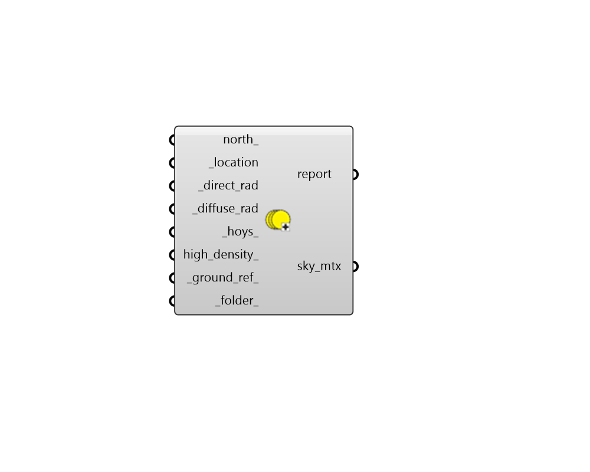
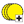

## Cumulative Sky Matrix

 - [[source code]](https://github.com/ladybug-tools/ladybug-grasshopper/blob/master/ladybug_grasshopper/src//LB%20Cumulative%20Sky%20Matrix.py)

Get a matrix containing radiation values from each patch of a sky dome. 

Creating this matrix is a necessary pre-step before doing incident radiation analysis with Rhino geometry or generating a radiation rose. 

This component uses Radiance's gendaymtx function to calculate the radiation for each patch of the sky. Gendaymtx is written by Ian Ashdown and Greg Ward. Morere information can be found in Radiance manual at: http://www.radiance-online.org/learning/documentation/manual-pages/pdfs/gendaymtx.pdf 

#### Inputs
* ##### north 
A number between -360 and 360 for the counterclockwise difference between the North and the positive Y-axis in degrees. 90 is West and 270 is East. This can also be Vector for the direction to North. (Default: 0) 
* ##### location [Required]
A ladybug Location that has been output from the "LB Import EPW" component or the "LB Construct Location" component. 
* ##### direct_rad [Required]
An annual hourly DataCollection of Direct Normal Radiation such as that which is output from the "LB Import EPW" component or the "LB Import STAT" component. 
* ##### diffuse_rad [Required]
An annual hourly DataCollection of Diffuse Horizontal Radiation such as that which is output from the "LB Import EPW" component or the "LB Import STAT" component. 
* ##### hoys 
A number or list of numbers between 0 and 8760 that respresent the hour(s) of the year for which to generate the sky matrix. The "LB Calculate HOY" component can output this number given a month, day and hour. The "LB Analysis Period" component can output a list of HOYs within a certain hour or date range. By default, the matrix will be for the entire year. 
* ##### high_density 
A Boolean to indicate whether the higher-density Reinhart sky matrix should be generated (True), which has roughly 4 times the sky patches as the (default) original Tregenza sky (False). Note that, while the Reinhart sky has a higher resolution and is more accurate, it will result in considerably longer calculation time for incident radiation studies. The difference in sky resolution can be observed with the "LB Sky Dome" component. (Default: False). 
* ##### ground_ref 
A number between 0 and 1 to note the average ground reflectance that is associated with the sky matrix. (Default: 0.2). 
* ##### folder 
The folder in which the Radiance commands are executed to produce the sky matrix. If None, it will be written to Ladybug's default EPW folder. 

#### Outputs
* ##### report
... 
* ##### sky_mtx
A sky matrix object containing the radiation coming from each patch of the sky. This can be used for a radiation study, a radition rose, or a sky dome visualization. It can also be deconstructed into its individual values with the "LB Deconstruct Matrix" component. 