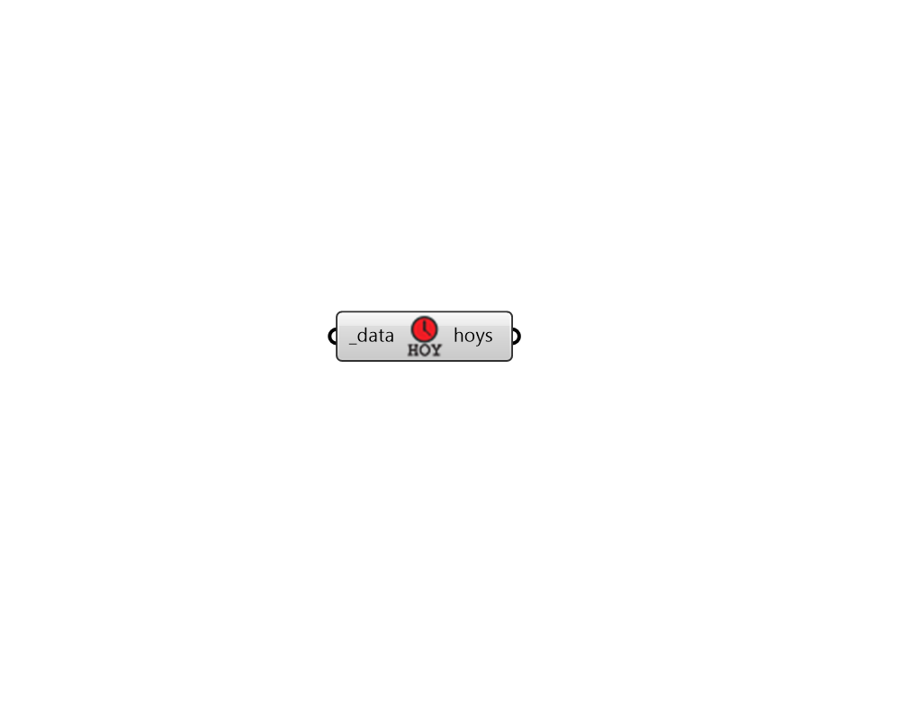

## Data DateTimes

 - [[source code]](https://github.com/ladybug-tools/ladybug-grasshopper/blob/master/ladybug_grasshopper/src//LB%20Data%20DateTimes.py)

Get the hours, days, or months of the year associated with the values of a data collection. 

#### Inputs
* ##### data [Required]
An hourly, daily, or monthly collection from which hours, days, or months of the year will be retrieved. 

#### Outputs
* ##### hoys
Numbers for the, hours, days or months of the year in the data collection. 