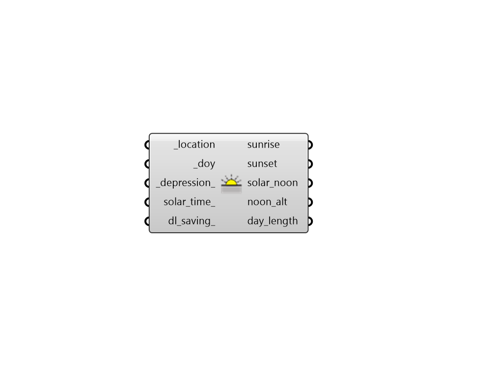

## Day Solar Information

 - [[source code]](https://github.com/ladybug-tools/ladybug-grasshopper/blob/master/ladybug_grasshopper/src//LB%20Day%20Solar%20Information.py)

Compute solar infomation about a day of the year at a particular location. This includes the time of sunrise, sunset, solar noon, and the length of the day in hours. 

Note that these times are intended to represent a typical year and they will often vary by a few minutes depending on where in the leap year cycle a given year falls. 

#### Inputs
* ##### location [Required]
A ladybug Location that has been output from the "LB Import EPW" component or the "LB Construct Location" component. 
* ##### doy [Required]
An integer for the day of the year for which solar information is be computed. The "LB Calculate HOY" component can be used to compute the day of the year from month and day inputs. 
* ##### depression 
An angle in degrees indicating the additional period before/after the edge of the sun has passed the horizon where the sun is still considered up. Setting this value to 0 will compute sunrise/sunset as the time when the edge of the sun begins to touch the horizon. Setting it to the angular diameter of the sun (0.5334) will compute sunrise/sunset as the time when the sun just finishes passing the horizon (actual physical sunset). Setting it to 0.833 will compute the apparent sunrise/sunset, accounting for atmospheric refraction. Setting this to 6 will compute sunrise/sunset as the beginning/end of civil twilight. Setting this to 12 will compute sunrise/sunset as the beginning/end of nautical twilight. Setting this to 18 will compute sunrise/sunset as the beginning/end of astronomical twilight. (Default: 0.5334 for the physical sunset). 
* ##### solar_time 
A boolean to indicate if the output datetimes for sunrise, noon and sunset should be in solar time as opposed to the time zone of the location. (Default: False). 
* ##### dl_saving 
An optional analysis period for daylight saving time. This will be used to adjust the output times by an hour when applicable. If unspecified, no daylight saving time will be used 

#### Outputs
* ##### sunrise
The time of sunrise expressed as HH:MM where hours range from 0 to 23. Note that this may be None if there is no sunrise or sunset on the specified day. (eg. at the north pole on the winter solstice). 
* ##### sunset
The time of sunset expressed as HH:MM where hours range from 0 to 23. Note that this may be None if there is no sunrise or sunset on the specified day. (eg. at the north pole on the winter solstice). 
* ##### solar_noon
The time of solar noon when the sun is at its highest point in the sky, expressed as HH:MM. 
* ##### noon_alt
The altitude of the sun at solar noon in degrees. This is the maximum altitude that will be expereinced on the input day. 
* ##### day_length
The length of the input day in hours. 