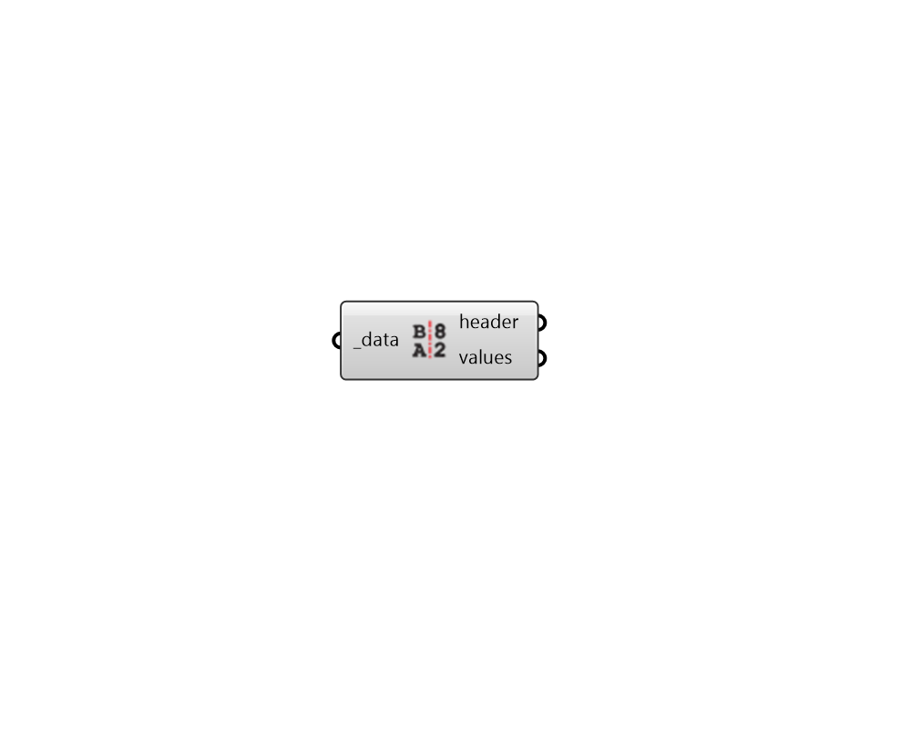

## Deconstruct Data
 - [[source code]](https://github.com/ladybug-tools/ladybug-grasshopper/blob/master/ladybug_grasshopper/src//LB%20Deconstruct%20Data.py)

Deconstruct a Ladybug DataCollection into a header and values.
 

#### Inputs
* ##### data [Required]
A Ladybug DataCollection object. 

#### Outputs
* ##### header
The header of the DataCollection (containing metadata). 
* ##### values
The numerical values of the DataCollection. 