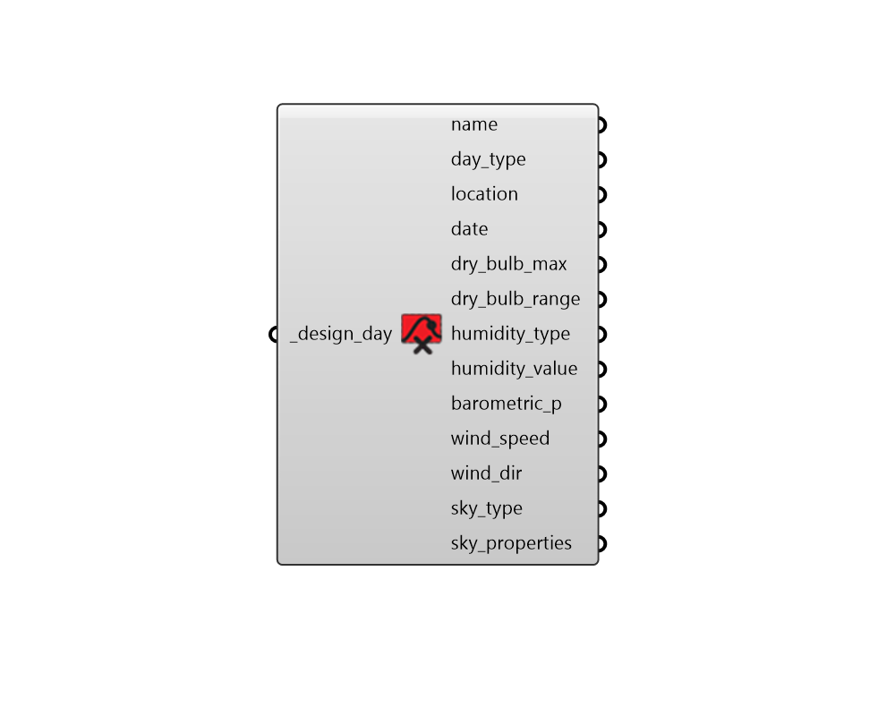

## Deconstruct Design Day

 - [[source code]](https://github.com/ladybug-tools/ladybug-grasshopper/blob/master/ladybug_grasshopper/src//LB%20Deconstruct%20Design%20Day.py)

Deconstruct design day into parameters. 

#### Inputs
* ##### design_day [Required]
A DesignDay object to deconstruct. 

#### Outputs
* ##### name
The name of the DesignDay object. 
* ##### day_type
Text indicating the type of design day (ie. 'SummerDesignDay', 'WinterDesignDay' or other EnergyPlus days). 
* ##### location
A Ladybug Location object describing the location of the design day. 
* ##### date
Date for the day of the year the design day 
* ##### dry_bulb_max
Maximum dry bulb temperature over the design day (in C). 
* ##### dry_bulb_range
Dry bulb range over the design day (in C). 
* ##### humidity_type
Type of humidity to use. Will be one of the following: 

    * Wetbulb

    * Dewpoint

    * HumidityRatio

    * Enthalpy
* ##### humidity_value
The value of the humidity condition above. 
* ##### barometric_p
Barometric pressure in Pa. 
* ##### wind_speed
Wind speed over the design day in m/s. 
* ##### wind_dir
Wind direction over the design day in degrees. 
* ##### sky_type
Script output sky_type. 
* ##### sky_properties
A list of properties describing the sky above. For ASHRAEClearSky this is a single value for clearness. For ASHRAETau, this is the tau_beam and tau_diffuse. 