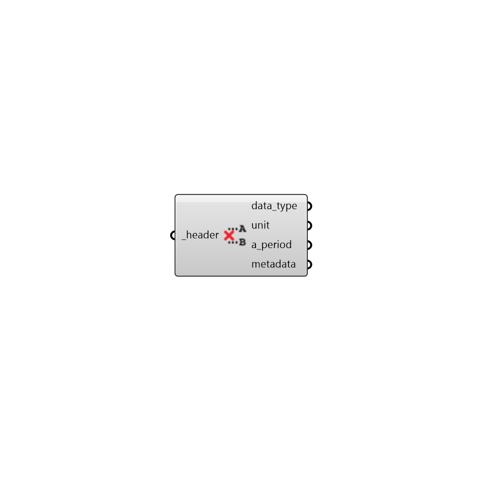

## Deconstruct Header

 - [[source code]](https://github.com/ladybug-tools/ladybug-grasshopper/blob/master/ladybug_grasshopper/src//LB%20Deconstruct%20Header.py)

Deconstruct a Ladybug Header into its components. 

#### Inputs
* ##### header [Required]
The header of the DataCollection (containing metadata). 

#### Outputs
* ##### data_type
Type of data (e.g. Temperature) (Default: unknown). 
* ##### unit
Units of the data_type (e.g. C) (Default: unknown) 
* ##### a_period
A Ladybug AnalysisPeriod object. 
* ##### metadata
Optional metadata associated with the Header. 