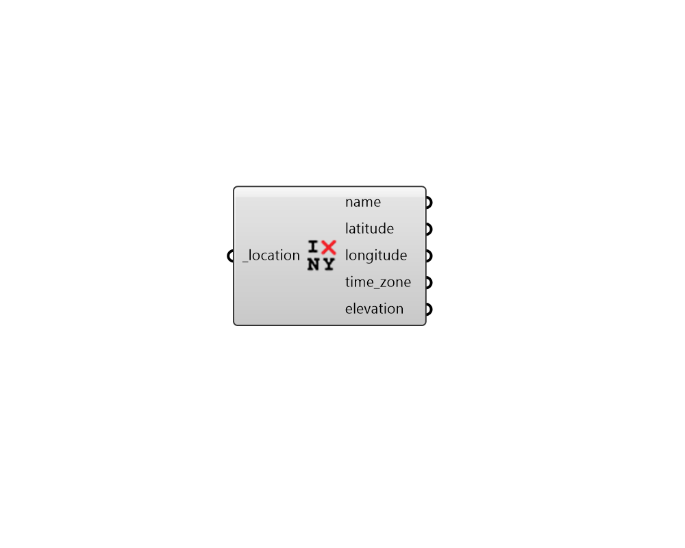

## Deconstruct Location

 - [[source code]](https://github.com/ladybug-tools/ladybug-grasshopper/blob/master/ladybug_grasshopper/src//LB%20Deconstruct%20Location.py)

Deconstruct location into its component properties. 

#### Inputs
* ##### location [Required]
The output from the importEPW or constructLocation component. 

#### Outputs
* ##### name
Name of the location. 
* ##### latitude
Latitude of the location. 
* ##### longitude
Longitude of the location. 
* ##### time_zone
Time zone of the location. 
* ##### elevation
Elevation of the location. 