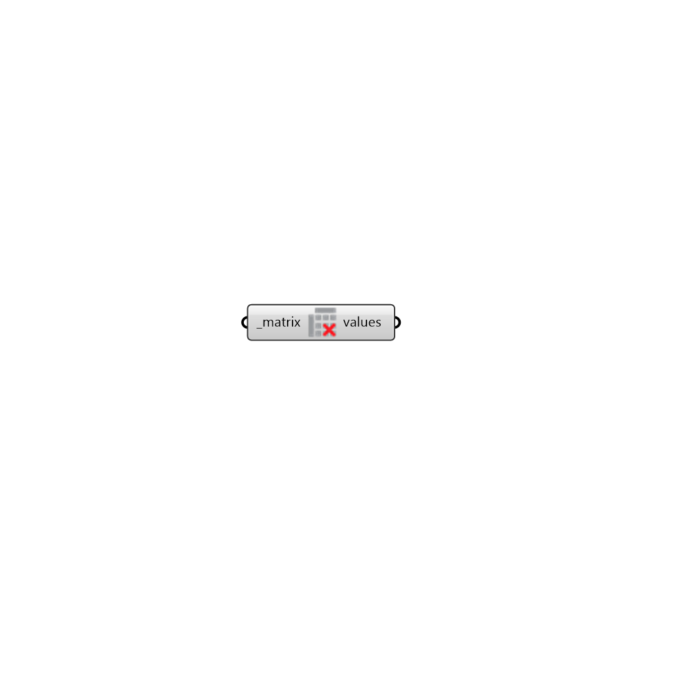

## Deconstruct Matrix

 - [[source code]](https://github.com/ladybug-tools/ladybug-grasshopper/blob/master/ladybug_grasshopper/src//LB%20Deconstruct%20Matrix.py)

Deconstruct a Ladybug Matrix object into a Grasshopper Data Tree of values. 

#### Inputs
* ##### matrix [Required]
A Ladybug Matrix object such as the intersection matrices output from any of the ray-tracing components (eg. "LB Direct Sun Hours"). 

#### Outputs
* ##### values
The numerical values of the matrix as a Grasshopper Data Tree. 