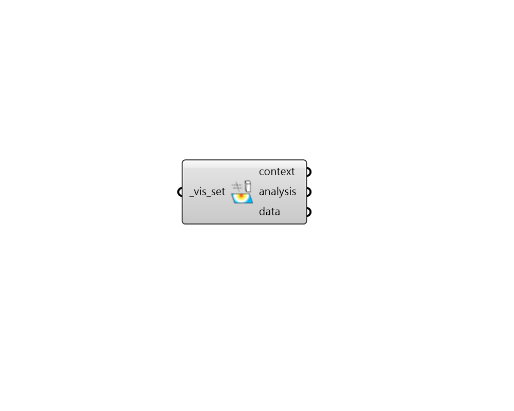

## Deconstruct VisualizationSet

 - [[source code]](https://github.com/ladybug-tools/ladybug-grasshopper/blob/master/ladybug_grasshopper/src//LB%20Deconstruct%20VisualizationSet.py)

Deconstruct a Ladybug VisualizationSet into all of its constituent objects. 

This includes Context Geometry, Analysis Geometry, and any data sets that are associated with the analysis geometry. The last one is particularly helpful for performing analysis in the data associated with a particular visualization. 

#### Inputs
* ##### vis_set [Required]
VisualizationSet arguments from any Ladybug Tools component with a vis_set output. This can also be the path to a .vsf file that exists on this machine (these files are often written with the "LB Dump VisualizationSet" component). Lastly, this input can be a custom VisualizationSet that has been created with the Ladybug Tools SDK. 

#### Outputs
* ##### context
A list of geometry objects that constitute the context geometry of the VisualizationSet. When the VisualizationSet contains multiple context geometry instances, this will be a data tree with one branch for each context object. 
* ##### analysis
A list of geometry objects that constitute the analysis geometry of the VisualizationSet. When the VisualizationSet contains multiple analysis geometry instances, this will be a data tree with one branch for each analysis object. 
* ##### data
A list of numbers that constitue the data set associated with the analysis geometry. In the event of multiple data sets assigned to the same analysis geometry, this will be a data tree of numbers with one branch for each data set. In the event of multiple analysis geometries, this will be a nested data tree where the first number in the path matches the analysis geometry branch and the last number matches the data set number. 