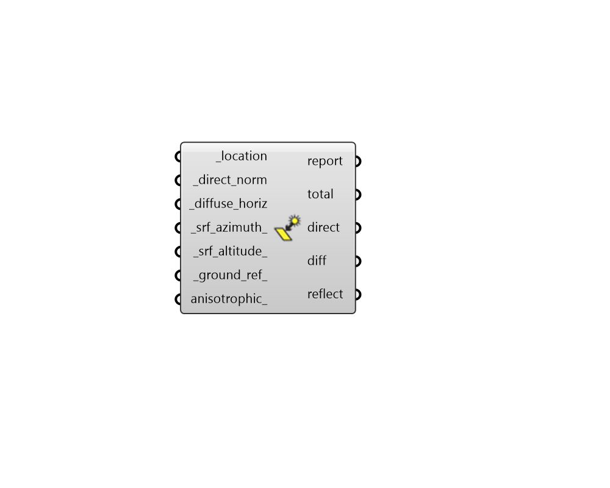

##  Directional Solar Irradiance - [[source code]](https://github.com/ladybug-tools/ladybug-grasshopper/blob/master/ladybug_grasshopper/src//LB%20Directional%20Solar%20Irradiance.py)

Compute the hourly solar irradiance or illuminance falling on an unobstructed surface
 that faces any direction.
 

The calculation method of this component is faster than running "LB Incident
 Radiation" studies on an hour-by-hour basis and it is slighty more realistic since
 it accounts for ground reflection. However, this comes at the cost of not being
 able to account for any obstructions that block the sun.
 

#### Inputs
* ##### location [Required]
A Ladybug Location object, used to determine the altitude and azimuth of the sun at each hour. 
* ##### direct_norm [Required]
Hourly Data Collection with the direct normal solar irradiance in W/m2 or Illuminance in lux. 
* ##### diffuse_horiz [Required]
Hourly Data Collection with diffuse horizontal solar irradiance in W/m2 or Illuminance in lux. 
* ##### srf_azimuth 
A number between 0 and 360 that represents the azimuth at which irradiance is being evaluated in degrees.  0 = North, 90 = East, 180 = South, and 270 = West.  (Default: 180). 
* ##### srf_altitude 
A number between -90 and 90 that represents the altitude at which irradiance is being evaluated in degrees. A value of 0 means the surface is facing the horizon and a value of 90 means a surface is facing straight up. (Default: 0). 
* ##### ground_ref 
A number between 0 and 1 that represents the reflectance of the ground. (Default: 0.2). Some common ground reflectances are: 

    *   urban: 0.18

    *   grass: 0.20

    *   fresh grass: 0.26

    *   soil: 0.17

    *   sand: 0.40

    *   snow: 0.65

    *   fresh_snow: 0.75

    *   asphalt: 0.12

    *   concrete: 0.30

    *   sea: 0.06
* ##### anisotrophic 
A boolean value that sets whether an anisotropic sky is used (as opposed to an isotropic sky). An isotrophic sky assumes an even distribution of diffuse irradiance across the sky while an anisotropic sky places more diffuse irradiance near the solar disc. (Default: False). 

#### Outputs
* ##### report
...
* ##### total
A data collection of total solar irradiance or illuminance in the direction of the _srf_azimuth_ and _srf_altitude_.
* ##### direct
A data collection of direct solar irradiance or illuminance in the direction of the _srf_azimuth_ and _srf_altitude_.
* ##### diff
A data collection of diffuse sky solar irradiance or illuminance in the direction of the _srf_azimuth_ and _srf_altitude_.
* ##### reflect
A data collection of ground reflected solar irradiance or illuminance in the direction of the _srf_azimuth_ and _srf_altitude_.