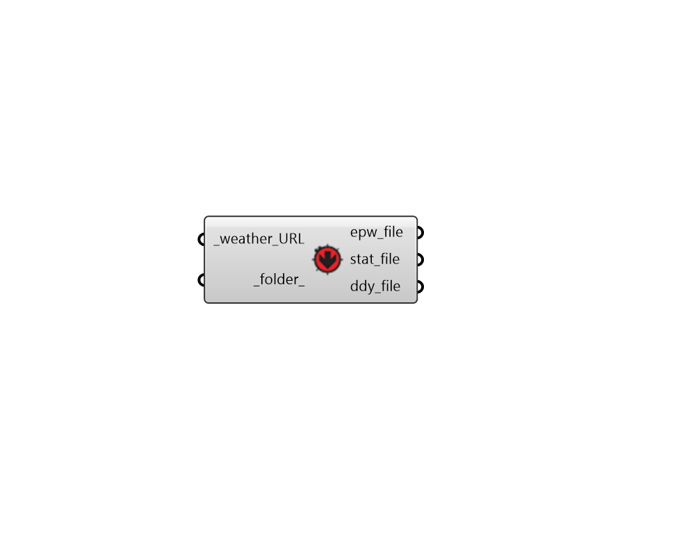

## Download Weather

 - [[source code]](https://github.com/ladybug-tools/ladybug-grasshopper/blob/master/ladybug_grasshopper/src//LB%20Download%20Weather.py)

Automatically download a .zip file from a URL where climate data resides, unzip the file, and open .epw, .stat, and ddy weather files. 

#### Inputs
* ##### weather_URL [Required]
Text representing the URL at which the climate data resides.  To open the a map interface for all publicly availabe climate data (epwmap), use the "EPWmap" component. 
* ##### folder 
An optional file path to a directory into which the weather file will be downloaded and unziped.  If None, the weather files will be downloaded to the ladybug default weather data folder and placed in a sub-folder with the name of the weather file location. 

#### Outputs
* ##### epw_file
The file path of the downloaded epw file. 
* ##### stat_file
The file path of the downloaded stat file. 
* ##### ddy_file
The file path of the downloaded ddy file. 