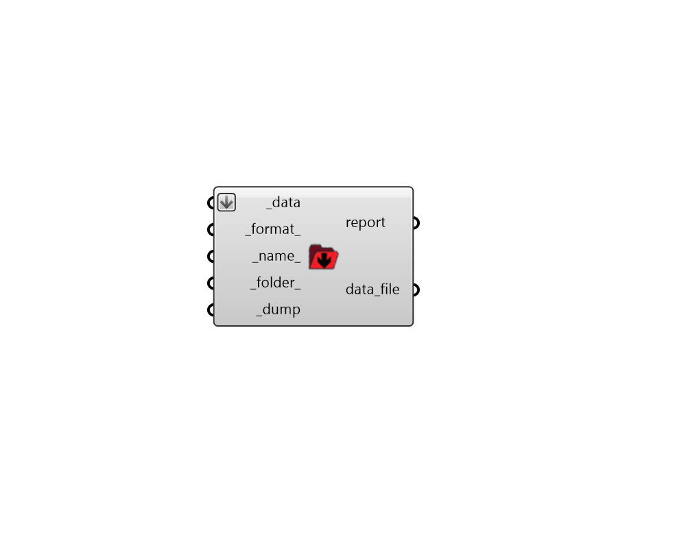

## Dump Data

 - [[source code]](https://github.com/ladybug-tools/ladybug-grasshopper/blob/master/ladybug_grasshopper/src//LB%20Dump%20Data.py)

Dump any Ladybug data collections into a file. You can use "LB Load Data" component to load the data collections from the file back into Grasshopper. 

#### Inputs
* ##### data [Required]
A list of Ladybug data collections to be written to a file. 
* ##### format 
Text or an integer to set the format of the output file. Choose from the options below. (Default: CSV). 

    * 0 = CSV - Compact, human-readable, importable to spreadsheets

    * 1 = JSON - Cross-language and handles any types of collections

    * 2 = PKL - Compressed format only readable with Python
* ##### name 
A name for the file to which the data collections will be written. (Default: 'data'). 
* ##### folder 
An optional directory into which the data collections will be written.  The default is set to a user-specific simulation folder. 
* ##### dump [Required]
Set to "True" to save the data collection to a file. 

#### Outputs
* ##### report
Errors, warnings, etc. 
* ##### data_file
The path of the file where the data collections are saved. 