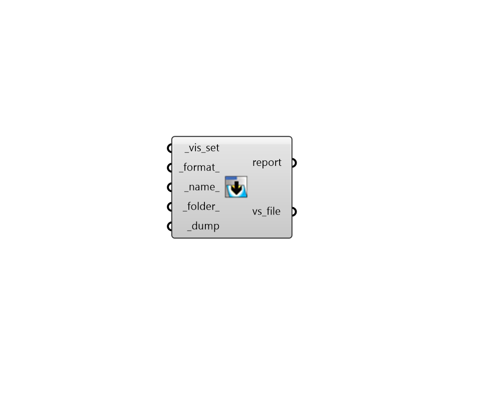

## Dump VisualizationSet

 - [[source code]](https://github.com/ladybug-tools/ladybug-grasshopper/blob/master/ladybug_grasshopper/src//LB%20Dump%20VisualizationSet.py)

Dump a Ladybug VisualiztionSet into a file. 

The "LB Preview VisualizationSet" component can be used to visualize the content from the file back into Grasshopper. 

#### Inputs
* ##### vis_set [Required]
A VisualizationSet object to be written to a file. This can also be VisualizationSet arguments from any Ladybug Tools component with a vis_set output. 
* ##### format 
Text or an integer to set the format of the output file. Choose from the options below. (Default: SVG). 

    * 0 = SVG - Interactive Scaleable Vector Graphic for web browsers

    * 1 = JSON - Cross-language and handles any types of collections

    * 2 = PKL - Compressed format only readable with Python
* ##### svg_view 
An optional text string for the view for which the SVG will be generated. Choose from the options below. (Default: Top). 

    * Top

    * Left

    * Right

    * Front

    * Back

    * NE

    * NW

    * SE

    * SW
* ##### svg_width 
The screen width in pixels. (Default: 800). 
* ##### svg_height 
The screen height in pixels. (Default: 600). 
* ##### legend_2d 
A boolean to note whether the geometry in the visulaization set should be rendered using the 2D Legend Parameters instead of the 3D ones. (Default: False). 
* ##### name 
A name for the file to which the VisualizationSet will be written. The default is derived from the identifier of the visualization set. 
* ##### folder 
An optional directory into which the VisualizationSet will be written.  The default is set to a user-specific simulation folder. 
* ##### dump [Required]
Set to "True" to save the VisualizationSet to a file. 

#### Outputs
* ##### report
Errors, warnings, etc. 
* ##### vs_file
The path of the file where the VisualisationSet is saved. The "LB Preview VisualizationSet" component can be used to visualize the content from the file back into Grasshopper. 