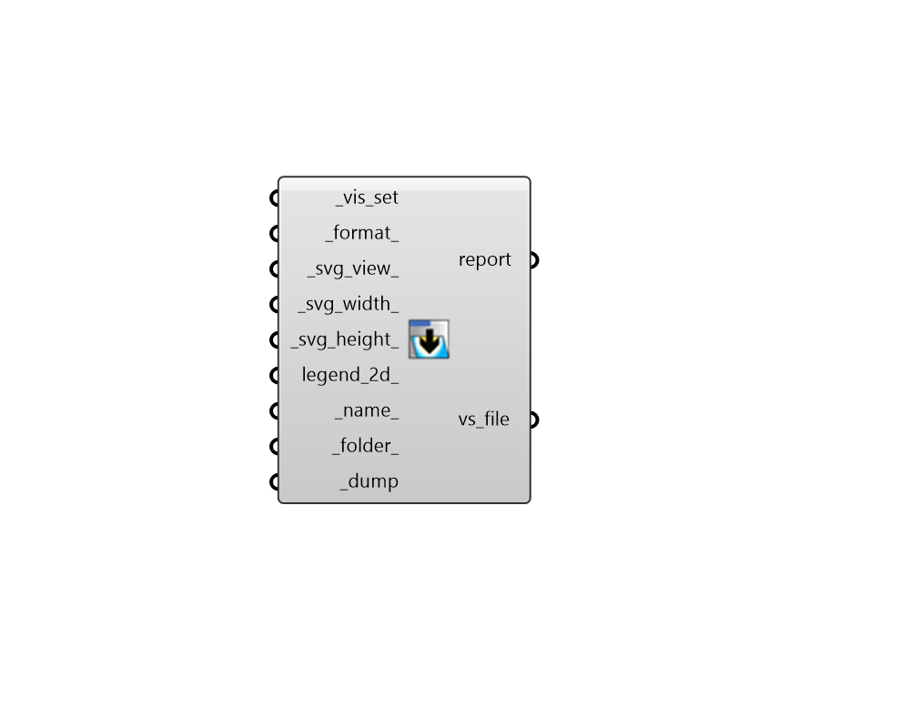

## Dump VisualizationSet

 - [[source code]](https://github.com/ladybug-tools/ladybug-grasshopper/blob/master/ladybug_grasshopper/src//LB%20Dump%20VisualizationSet.py)

Dump a Ladybug VisualiztionSet into a file. 

The "LB Preview VisualizationSet" component can be used to visualize the content from the file back into Grasshopper. 

#### Inputs
* ##### vs [Required]
A VisualizationSet object to be written to a file. Typically, this is the output from the "LB Preview VisualizationSet" component but it can also be a custom VisualiztionSet object created with the Ladybug Tools SDK. 
* ##### format 
Text or an integer to set the format of the output file. Choose from the options below. (Default: JSON). 

    * 0 = JSON - Cross-language and handles any types of collections

    * 1 = PKL - Compressed format only readable with Python
* ##### name 
A name for the file to which the VisualizationSet will be written. The default is derived from the identifier of the visualization set. 
* ##### folder 
An optional directory into which the VisualizationSet will be written.  The default is set to a user-specific simulation folder. 
* ##### dump [Required]
Set to "True" to save the VisualizationSet to a file. 

#### Outputs
* ##### report
Errors, warnings, etc. 
* ##### vs_file
The path of the file where the VisualisationSet is saved. 