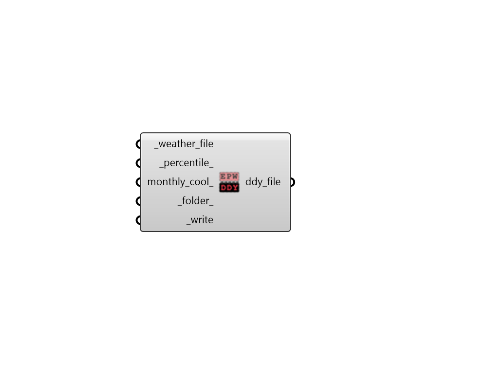

##  EPW to DDY - [[source code]](https://github.com/ladybug-tools/ladybug-grasshopper/blob/master/ladybug_grasshopper/src//LB%20EPW%20to%20DDY.py)

Produce a DDY file with a heating and a cooling design day from an EPW.
 

This method will first check if there is any heating or cooling design day information
 contained within the EPW itself. If None is found, the heating and cooling design
 days will be derived from analysis of the annual data within the EPW, which is
 usually less representative of the climate since only one year of data is used
 to derive the DDY (instead of the usual multi-year analysis that is performed for
 DDYs distributed with EPWs).
 

Information on the uncertainty introduced by using only one year of data to create
 design days can be found in AHSRAE HOF 2013, Chapter 14.14.
 

#### Inputs
* ##### epw_file [Required]
An .epw file path on your system, from which a .ddy will be generated. 
* ##### percentile 
A number between 0 and 50 for the percentile difference from the most extreme conditions within the EPW to be used for the design day. Typical values are 0.4 and 1.0. (Default: 0.4). 
* ##### folder 
An optional file path to a directory into which the DDY file will be written.  If None, the DDY file will be written to the ladybug default weather data folder and placed in a sub-folder called "ddy". 
* ##### write [Required]
Set to "True" to write the .ddy file. 

#### Outputs
* ##### ddy_file
A .ddy file path that has been written to your system.