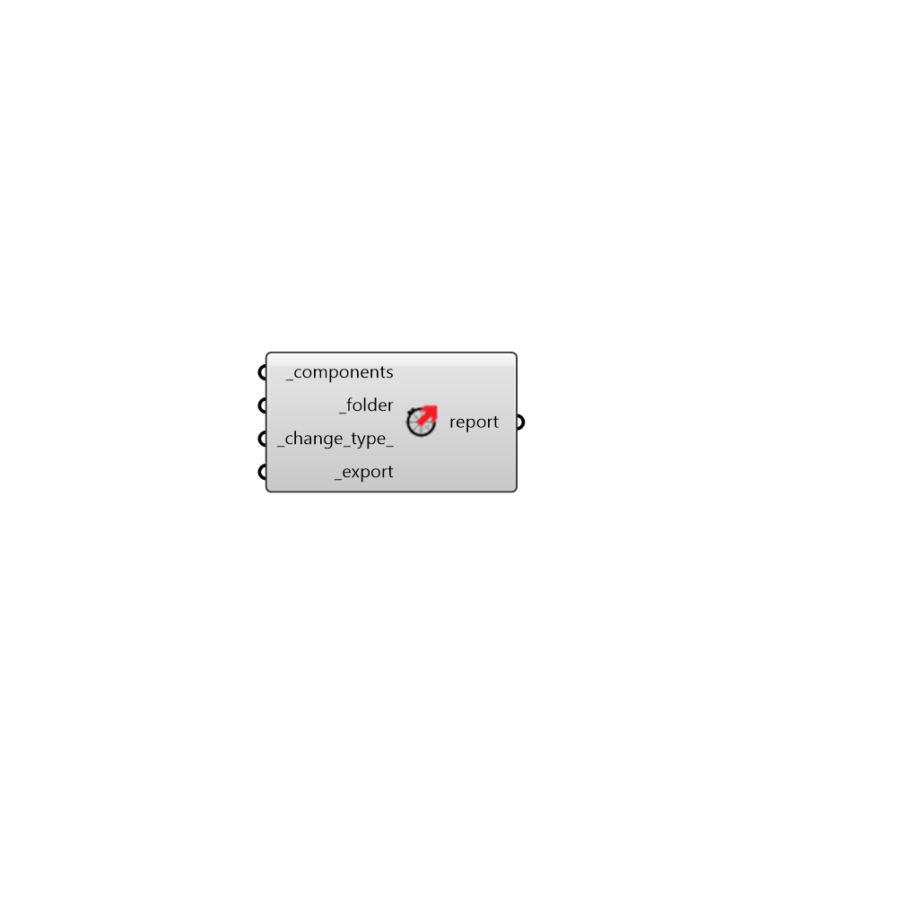

##  Export UserObject - [[source code]](https://github.com/ladybug-tools/ladybug-grasshopper/blob/master/ladybug_grasshopper/src//LB%20Export%20UserObject.py)

Export a Ladybug Tools Grasshopper GHPython component as a UserObject that can
 be installed on other's machines.
 

#### Inputs
* ##### components [Required]
A Ladybug Tools GHPython component to be exported. This can also be a list of of components to be exported together. Lastly, this can be a "*" and all of the Ladybug Tools components on the Grasshopper canvass will be exported. 
* ##### folder [Required]
Full path to folder to copy the updated UserObject and the source code. It is usually path to where you have cloned the repository from GitHub. Exported contents will be created under src and userobject folders. 
* ##### change_type 
One of the values listed below based on the type of change made to the component. Export component will validate the version of the newly created UserObject against the version of the current installed UserObject with the same name based on the change type. If an older version of the component does not exist the current version of the component will be used. The version is structured as major.minor.patch. (Default: fix) 

    * release: You are changing the versions for a new release.Bump the major with 1 and set minor and patch to 0. 

    * feat: You have added a new feature. Adding a new feature usuallyresults in a change in inputs or outputs of the component. Bump minor by 1 and set patch to 0. 

    * perf: You have improved the component for better performance.Similar to adding a feature you should bump the minor by 1 and set patch to 0. 

    * fix: You have fixed the code inside the component. It results ina single bump in patch. 

    * docs: You have improved the documentation. No change in version.

    * ignore: This is an exception to the rule and you want the changetype to be ignored. You should use this option only in rare occasional cases. 
* ##### export [Required]
Set to True to export the component. 

#### Outputs
* ##### report
Errors, warnings, etc.