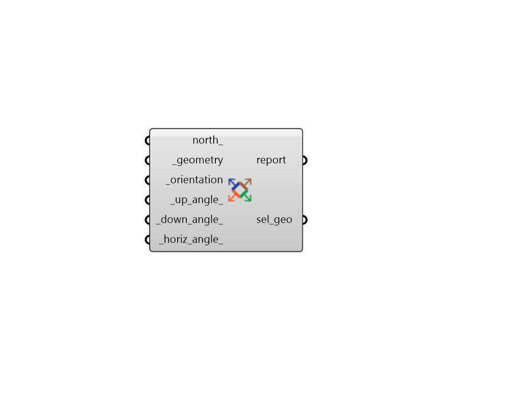

## Filter by Normal

 - [[source code]](https://github.com/ladybug-tools/ladybug-grasshopper/blob/master/ladybug_grasshopper/src//LB%20Filter%20by%20Normal.py)

Filter or select faces of geometry based on their orientation. 

#### Inputs
* ##### north 
A number between -360 and 360 for the counterclockwise difference between the North and the positive Y-axis in degrees. 90 is West and 270 is East. This can also be Vector for the direction to North. (Default: 0) 
* ##### geometry [Required]
Rhino Breps and/or Rhino Meshes which will be broken down into individual planar faces and filtered based on the direction they face. 
* ##### orientation [Required]
Text for the direction that the geometry is facing. This can also be a number between 0 and 360 for the azimuth (clockwise horizontal degrees from North) that the geometry should face. Choose from the following: 

    * N = North

    * NE = Northeast

    * E = East

    * SE = Southeast

    * S = South

    * SW = Southwest

    * W = West

    * NW = Northwest

    * Up = Upwards

    * Down = Downwards
* ##### up_angle 
A number in degrees for the maximum declination angle from the positive Z Axis that is considerd up. This should be between 0 and 90 for the results to be practical. (Default: 30). 
* ##### down_angle 
A number in degrees for the maximum angle difference from the newative Z Axis that is considerd down. This should be between 0 and 90 for the results to be practical. (Default: 30). 
* ##### horiz_angle 
Angle in degrees for the horizontal deviation from _orientation that is still considered to face that orientation. This should be between 0 and 90 for the results to be practical. Note that this input has no effect when the input orientation is "Up" or "Down". (Default: 23). 

#### Outputs
* ##### report
... 
* ##### sel_geo
Selected faces of the input geometry that are facing the direction corresponding to the input criteria. 