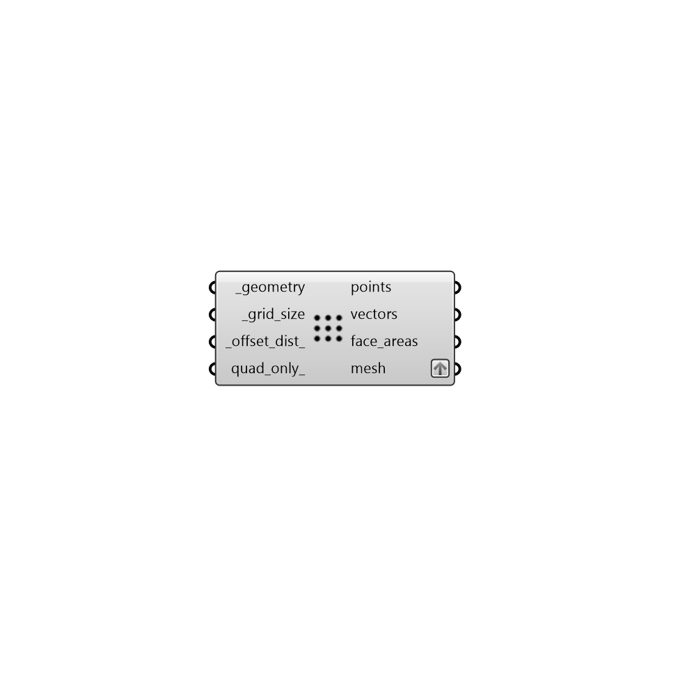

## Generate Point Grid

 - [[source code]](https://github.com/ladybug-tools/ladybug-grasshopper/blob/master/ladybug_grasshopper/src//LB%20Generate%20Point%20Grid.py)

Genrate a mesh with corresponding test points from a Rhino Brep (or Mesh). 

The resulting mesh will be in a format that the "LB Spatial Heatmap" component will accept. 

#### Inputs
* ##### geometry [Required]
Brep or Mesh from which to generate the points and grid. 
* ##### grid_size [Required]
Number for the size of the test grid. 
* ##### offset_dist 
Number for the distance to move points from the surfaces of the input _geometry.  Typically, this should be a small positive number to ensure points are not blocked by the mesh. (Default: 0). 
* ##### quad_only 
Boolean to note whether meshing should be done using Rhino's defaults (False), which fills the entire _geometry to the edges with both quad and tringulated faces, or a mesh with only quad faces should be generated. 
FOR ADVANCED USERS: This input can also be a vector object that will be used to set the orientation of the quad-only grid. Note that, if a vector is input here that is not aligned with the plane of the input _geometry, an error will be raised. 

#### Outputs
* ##### points
Test points at the center of each mesh face. 
* ##### vectors
Vectors for the normal direction at each of the points. 
* ##### face_areas
Area of each mesh face. 
* ##### mesh
Analysis mesh that can be passed to the "LB Spatial Heatmap" component. 