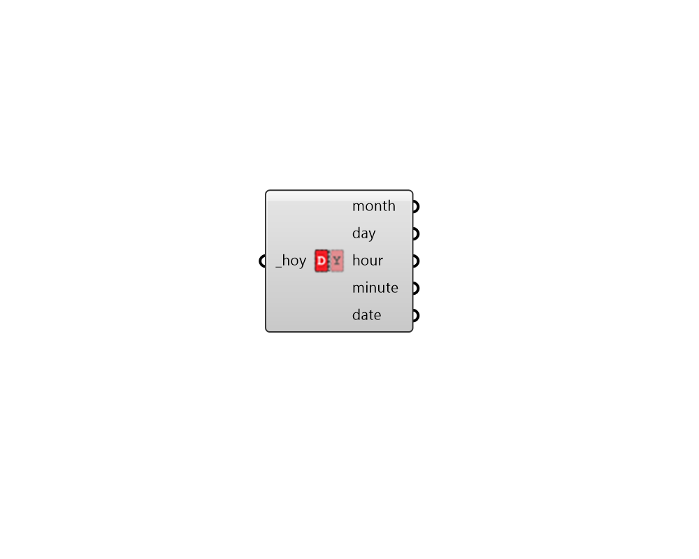

## HOY to DateTime

 - [[source code]](https://github.com/ladybug-tools/ladybug-grasshopper/blob/master/ladybug_grasshopper/src//LB%20HOY%20to%20DateTime.py)

Calculate date information from an hour of the year. 

Date information includes the month of the year, day of the month and the hour + minute of the day. 

#### Inputs
* ##### hoy [Required]
A number between 0 and 8759 for an hour of the year. 

#### Outputs
* ##### month
The month of the year on which the input hoy falls. 
* ##### day
The day of the month on which the input hoy falls. 
* ##### hour
The hour of the day on which the input hoy falls. 
* ##### minute
The minute of the hour on which the input hoy falls. 
* ##### date
The input information as a human-readable date time. 